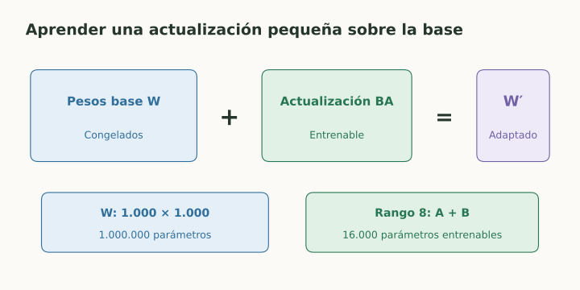
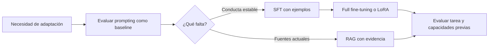

# Fine-tuning, LoRA y alineación

> **En una frase:** adaptar un modelo cambia su comportamiento aprendido; necesita datos y una evaluación independiente.

## Vista rápida

- SFT aprende respuestas objetivo; preferencias orientan comportamiento.
- LoRA entrena una actualización pequeña sobre pesos base congelados.

## Etapas y métodos
| Concepto | Qué se optimiza |
|---|---|
| Pretraining | Objetivos generales sobre grandes colecciones |
| Continued pretraining | Continuar el objetivo base con datos de un dominio |
| SFT | Respuestas objetivo dadas entradas e instrucciones |
| RLHF | Política mediante recompensas aprendidas de preferencias |
| DPO | Preferencia por respuestas elegidas frente a rechazadas, mediante un objetivo directo |

Las preferencias no son un oráculo de verdad. Una respuesta atractiva puede ser incorrecta; los datos y el criterio de preferencia importan.

## LoRA
Congela pesos base y aprende una actualización de rango reducido:

$$
W'=W+\Delta W,\qquad \Delta W=\frac{\alpha}{r}BA.
$$

Para $W$ de tamaño $d_{\text{out}}\times d_{\text{in}}$, $B$ es $d_{\text{out}}\times r$ y $A$ es $r\times d_{\text{in}}$.

**Ejemplo:** una matriz $1000\times1000$ tiene un millón de parámetros. Con rango 8, $A$ y $B$ suman 16.000 parámetros entrenables en esa actualización. La memoria total también incluye modelo base, activaciones y optimizador.

## Cuándo aporta
Si la tarea y el formato están estables y tenés buenos ejemplos, adaptación puede mejorar consistencia. Para consultar documentos cambiantes, RAG ofrece acceso explícito a evidencia.

Compará primero un buen prompt y un baseline. Reservá usuarios o conversaciones para test y medí capacidades generales, no solo la tarea adaptada.

## Riesgos
Memorización, sobreajuste y pérdida de capacidades previas. Conservar pesos o adapters versionados permite comparar y revertir.

## Flujo del concepto

## Se conecta con
[[Prompting, RAG o fine-tuning]] · [[Train, validation, test y leakage]] · [[Regresiones y CI]]

## Fuentes
- [Hu et al. · LoRA](https://arxiv.org/abs/2106.09685)
- [Ouyang et al. · aprendizaje con feedback humano](https://arxiv.org/abs/2203.02155)
- [Rafailov et al. · DPO](https://arxiv.org/abs/2305.18290)
