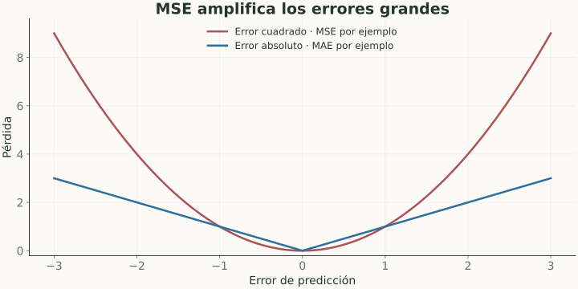

# Funciones de pérdida

> **En una frase:** la loss define qué error intenta reducir el entrenamiento.

## Vista rápida

- MSE castiga más los errores grandes que MAE.
- Mejor loss no garantiza mejores respuestas verificadas.

## Objetivo de aprendizaje
Para $n$ ejemplos:

$$
L(\theta)=\frac1n\sum_{i=1}^n \ell(f_\theta(x_i),y_i).
$$

| Loss | Fórmula o idea | Aplicación |
|---|---|---|
| MSE | $\frac1n\sum_i(\hat y_i-y_i)^2$ | Regresión; castiga más errores grandes |
| MAE | $\frac1n\sum_i\lvert\hat y_i-y_i\rvert$ | Regresión; menos sensible a extremos |
| Binary cross-entropy | $-[y\log p+(1-y)\log(1-p)]$ | Clasificación binaria |
| Cross-entropy multiclase | $-\log p_{\text{clase correcta}}$ | Siguiente token o clasificación |

**Ejemplo:** si la clase correcta tiene probabilidad 0.8, la cross-entropy con logaritmo natural es $\approx0.223$. Si tiene 0.1, es $\approx2.303$. Castiga estar seguro y equivocado.

## Loss y métrica de producto
Se entrena con una señal que permita optimizar; se decide con métricas de la tarea. Menor loss no implica necesariamente mayor F1 en un umbral fijo, ni mejores respuestas verificadas.

En lenguaje, acertar tokens frecuentes reduce loss, pero no garantiza respetar permisos, citar evidencia o completar una acción.

Pesos de clase y términos de regularización modifican el objetivo. Documentá esos cambios antes de comparar curvas de entrenamiento.

## Se conecta con
[[Gradiente, backpropagation y optimización]] · [[Métricas de regresión]] · [[Objetivos de lenguaje y perplexity]] · [[Evals]]

## Fuentes
- [Google · loss](https://developers.google.com/machine-learning/crash-course/linear-regression/loss)
- [scikit-learn · métricas y scoring](https://scikit-learn.org/stable/modules/model_evaluation.html)
