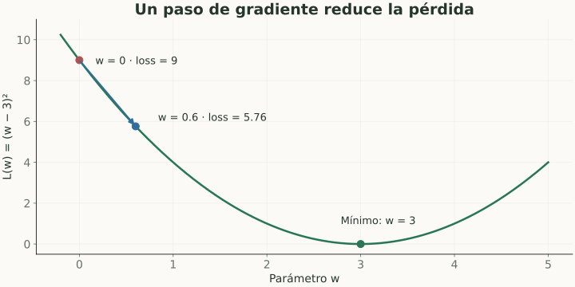
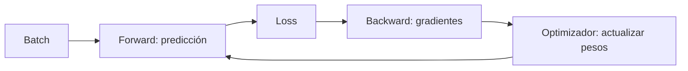

# Gradiente, backpropagation y optimización

> **En una frase:** el gradiente indica cómo cambiar parámetros; backpropagation lo calcula y el optimizador aplica el cambio.

## Vista rápida

- Backpropagation calcula gradientes; el optimizador actualiza pesos.
- El learning rate controla el tamaño del paso.

## Cálculo mínimo
Una **derivada** mide cómo cambia una función al cambiar una variable. El **gradiente** reúne derivadas respecto de muchos parámetros. Backpropagation usa la regla de la cadena a través de las capas.

Gradient descent básico:

$$
\theta_{t+1}=\theta_t-\eta\nabla_\theta L(\theta_t).
$$

$\eta$ es el learning rate. **Ejemplo:** $L(w)=(w-3)^2$, $w=0$ → gradiente $-6$. Con $\eta=0.1$, el siguiente peso es $0.6$ y la loss baja de $9$ a $5.76$.

## Vocabulario del entrenamiento
| Término | Significado |
|---|---|
| Batch | Ejemplos usados en un cálculo de gradiente |
| Step | Una actualización de parámetros |
| Epoch | Una pasada por el conjunto de entrenamiento |
| SGD | Actualizar con gradientes de muestras o minibatches |
| Adam | Adaptar actualizaciones usando momentos del gradiente |

Un learning rate muy alto puede desestabilizar; muy bajo puede avanzar lentamente. Más epochs pueden mejorar train mientras empeoran validation.

## En Gen AI
Fine-tuning repite este ciclo. Prompting e inferencia habitual no lo hacen. Registrar curvas de train y validation ayuda a detectar sobreajuste y fallas de optimización.

## Se conecta con
[[Redes neuronales y deep learning]] · [[Overfitting, bias, variance y regularización]] · [[Fine-tuning, LoRA y alineación]]

## Fuentes
- [Google · gradient descent](https://developers.google.com/machine-learning/crash-course/linear-regression/gradient-descent)
- [PyTorch · autodiferenciación](https://docs.pytorch.org/tutorials/beginner/basics/autogradqs_tutorial.html)
