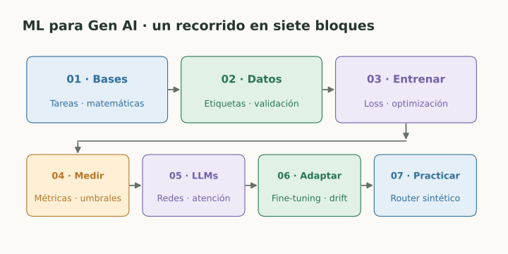

# ML para Gen AI

> **En una frase:** entender los datos, el aprendizaje y las métricas de ML para tomar mejores decisiones con RAG, LLMs y agentes.

## Vista rápida



## Qué vas a aprender
Esta sección reúne las bases de ML que reaparecen en Gen AI: tareas, matemáticas, datos, entrenamiento, evaluación, representaciones y adaptación. No necesitás entrenar un LLM desde cero para aprovecharlas.

La diferencia práctica: **clasificar**, **recuperar evidencia** y **generar respuestas** necesitan criterios distintos. Precision y recall pueden evaluar un detector o la recuperación; no miden por sí solas la calidad total de un asistente.

## Orden de lectura
| Bloque | Notas en orden |
|---|---|
| **01 · Bases matemáticas** | [[ML, tareas y tipos de aprendizaje]] → [[Álgebra lineal para embeddings]] → [[Probabilidad y estadística para ML]] |
| **02 · Datos y validación** | [[Datos, features y etiquetas]] → [[Train, validation, test y leakage]] → [[Desbalance y calidad de etiquetas]] |
| **03 · Modelos y entrenamiento** | [[Modelos clásicos y baselines]] → [[Clustering y reducción de dimensionalidad]] → [[Funciones de pérdida]] → [[Gradiente, backpropagation y optimización]] → [[Overfitting, bias, variance y regularización]] |
| **04 · Métricas y decisiones** | [[Matriz de confusión y accuracy]] → [[Precision y recall]] → [[F1, F-beta y promedios por clase]] → [[Umbrales y costo de errores]] → [[Curvas ROC y AUC]] → [[Curva Precision-Recall y Average Precision]] → [[Calibración y confianza]] → [[Métricas de regresión]] → [[Métricas de ranking y recuperación]] |
| **05 · De ML a LLMs** | [[Redes neuronales y deep learning]] → [[Embeddings y aprendizaje de representaciones]] → [[Attention y Transformers]] → [[Objetivos de lenguaje y perplexity]] |
| **06 · Adaptación y uso real** | [[Fine-tuning, LoRA y alineación]] → [[Experimentos e incertidumbre]] → [[Distribución, drift y monitoreo]] |
| **07 · Practicar** | [[Caso práctico - Métricas de un router Gen AI]] |

Los bloques son un recorrido de estudio. Los modelos clásicos son alternativas para comparar; no forman un pipeline que deba ejecutarse completo.

## Ruta rápida para métricas
[[Matriz de confusión y accuracy]] → [[Precision y recall]] → [[F1, F-beta y promedios por clase]] → [[Umbrales y costo de errores]] → [[Curvas ROC y AUC]] → [[Curva Precision-Recall y Average Precision]] → [[Calibración y confianza]] → [[Caso práctico - Métricas de un router Gen AI]].

## Elegir la medida según la pregunta
| Quiero saber… | Estudiar |
|---|---|
| Qué errores comete un detector | [[Matriz de confusión y accuracy]], [[Precision y recall]] |
| Cómo cambiar el punto de decisión | [[Umbrales y costo de errores]] |
| Qué tan bien ordena positivos y negativos | [[Curvas ROC y AUC]] |
| Qué pasa cuando la clase es rara | [[Curva Precision-Recall y Average Precision]] |
| Si 0.8 representa una frecuencia real cercana al 80% | [[Calibración y confianza]] |
| Si RAG encuentra y ordena evidencia | [[Métricas de ranking y recuperación]], [[RAG evals]] |
| Si las respuestas son correctas y respaldadas | [[RAG evals]], [[Graders]], [[Golden dataset]] |
| Si una mejora se sostiene fuera de los ejemplos vistos | [[Train, validation, test y leakage]], [[Experimentos e incertidumbre]] |

## Cómo estudiar
Todas las notas empiezan en **por-ver**. Cambiá el campo **estado** a **aprendiendo** o **dominado** para actualizar el tablero de [[README#Progreso|Progreso]]. Cada nota tiene una idea central, ejemplos y conexiones.

Para empezar desde cero, seguí el orden de bloques. Si ya manejás datos y entrenamiento, empezá por la ruta de métricas y después completá las bases pendientes.

## Conexiones con otras categorías
- **[[Fundamentos]]:** elección de modelos y decisión entre prompting, RAG y fine-tuning.
- **[[RAG]]:** embeddings, similitud, ranking y evaluación de recuperación.
- **[[Evals]]:** datasets, jueces, comparaciones y regresiones.
- **[[Runtime de agentes]]:** monitoreo, distribución de tráfico y operación.

## Estado de los nodos
```dataview
TABLE WITHOUT ID file.link AS nodo, bloque, estado
FROM "ml-gen-ai" WHERE tipo != "mapa" SORT orden
```

[[ML para Gen AI.canvas|Abrir el canvas de ML para Gen AI]]

## Fuente de estudio
[Google · Machine Learning Crash Course](https://developers.google.com/machine-learning/crash-course). Cada nota agrega sus fuentes específicas y ejemplos didácticos.
