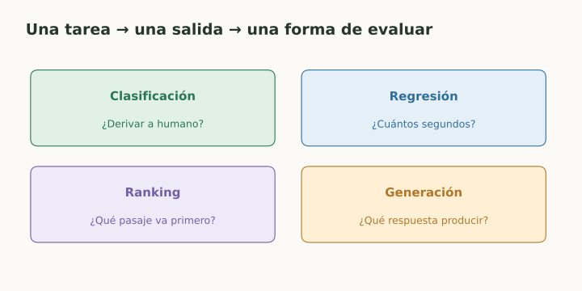
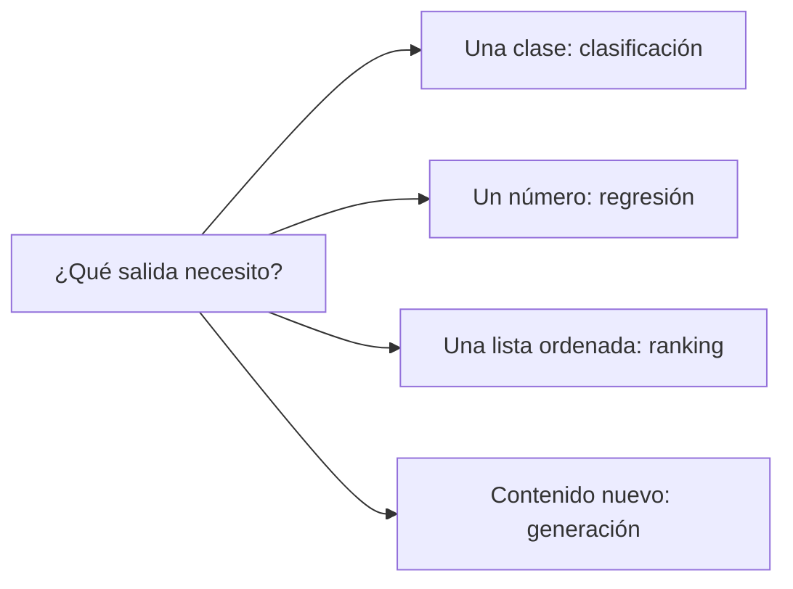

# ML, tareas y tipos de aprendizaje

> **En una frase:** ML aprende patrones a partir de datos; Gen AI usa modelos aprendidos para generar contenido.

## Vista rápida

- Clasificar, predecir números, ordenar y generar son tareas distintas.
- Entrenar cambia parámetros; inferir usa lo aprendido.

## El vocabulario que reaparece en todo
Un **ejemplo** es una observación; las **features** son sus entradas y el **target** es lo que queremos predecir. Un modelo $f_\theta(x)$ transforma la entrada usando **parámetros** $\theta$ aprendidos. Los **hiperparámetros**, como learning rate y profundidad, se eligen durante el desarrollo.

**Entrenamiento** cambia parámetros; **inferencia** los usa. Dar documentos en un prompt o recuperar contexto con RAG no modifica por sí solo los pesos.

| Aprendizaje | Señal de aprendizaje | Aplicación a Gen AI |
|---|---|---|
| Supervisado | Entradas con etiquetas o respuestas | Router de tickets; ejemplos para SFT |
| No supervisado | Estructura sin etiquetas de tarea | Agrupar consultas y detectar patrones |
| Autosupervisado | El target se construye desde el propio dato | Predecir el siguiente token |
| Por refuerzo | Recompensa por acciones o resultados | Optimizar una política de respuesta |

Estas categorías se pueden combinar. “Generativo” describe qué modelamos y producimos; “autosupervisado” describe de dónde sale la señal.

## Elegí primero la tarea
**Clasificación:** “¿necesita escalarse?”. **Regresión:** “¿cuántos segundos tardará?”. **Ranking:** “¿qué pasaje va primero?”. **Generación:** “¿qué respuesta produce?”.

Ejemplo: un asistente puede recuperar pasajes, generar texto y clasificar si debe derivar. Cada componente necesita etiquetas y métricas diferentes; no existe un único “accuracy del asistente”.

## Flujo del concepto

## Se conecta con
[[LLMs y elección de modelo]] · [[Datos, features y etiquetas]] · [[Objetivos de lenguaje y perplexity]]

## Fuentes
- [Google · qué es ML](https://developers.google.com/machine-learning/intro-to-ml/what-is-ml)
