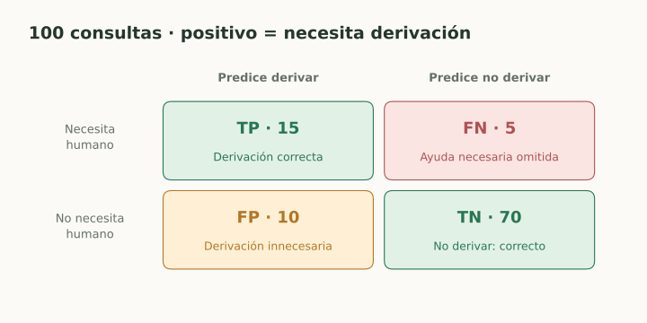

# Matriz de confusión y accuracy

> **En una frase:** la matriz de confusión muestra qué aciertos y errores comete una clasificación.

## Vista rápida

- Positivo significa necesita derivación, no significa bueno.
- TP y TN son aciertos; FP y FN son errores diferentes.

## Definí primero el positivo
En estas notas: **positivo = consulta que necesita derivación humana**. “Positivo” no significa bueno; es la clase de interés.

Ejemplo didáctico de 100 consultas, con 20 que necesitan derivación:

| Realidad ↓ / Predicción → | Derivar (+) | No derivar (−) | Total |
|---|---|---|---|
| Necesita derivación (+) | **TP = 15** | **FN = 5** | 20 |
| No necesita derivación (−) | **FP = 10** | **TN = 70** | 80 |
| Total | 25 | 75 | 100 |

TP: derivación correcta. FP: derivación innecesaria. FN: consulta que quedó sin la ayuda necesaria. TN: consulta correctamente no derivada.

$$
\text{accuracy}=\frac{TP+TN}{TP+TN+FP+FN}=\frac{85}{100}=85\%.
$$

## Cómo leerla
Preguntá qué errores importan y cuántos hay de cada uno. Esta misma matriz tendrá precision 60%, recall 75% y F1 $\approx66.7\%$. No son formas equivalentes de decir “85%”.

Los conteos dependen del umbral y de la distribución de casos. Guardá ambas cosas junto al resultado.

## En Gen AI
Podés usarla para routers, detectores o una rúbrica binaria de calidad. Para respuestas abiertas primero necesitás definir y validar esa rúbrica.

## Se conecta con
[[Precision y recall]] · [[F1, F-beta y promedios por clase]] · [[Umbrales y costo de errores]] · [[Caso práctico - Métricas de un router Gen AI]]

## Fuentes
- [scikit-learn · métricas de clasificación](https://scikit-learn.org/stable/modules/model_evaluation.html)
