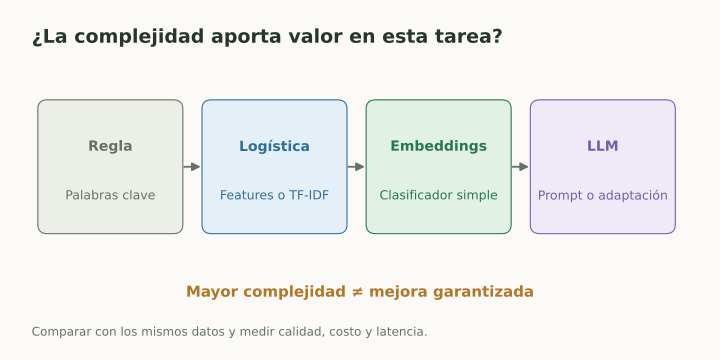

# Modelos clásicos y baselines

> **En una frase:** un modelo sencillo permite saber si la complejidad de Gen AI aporta valor.

## Vista rápida

- El baseline permite medir qué aporta un modelo más complejo.
- Compará calidad, costo y latencia sobre los mismos casos.

## Dos bases fundamentales
**Regresión lineal:** $\hat y=w^\top x+b$. Predice un valor numérico combinando features.

**Regresión logística:** $p=\sigma(w^\top x+b)$, donde $\sigma(z)=1/(1+e^{-z})$. Aunque se llame regresión, se usa para clasificación; convierte un logit en un valor entre 0 y 1. La decisión requiere un umbral y la probabilidad necesita validación.

| Familia | Intuición | Uso posible junto a Gen AI |
|---|---|---|
| Árbol | Reglas sucesivas sobre features | Router interpretable |
| Random forest | Promediar o votar varios árboles | Clasificación tabular |
| Gradient boosting | Agregar modelos que corrigen errores | Predicción con señales tabulares |
| k-nearest neighbors | Usar ejemplos cercanos | Clasificar embeddings |
| Naive Bayes | Combinar evidencia con supuestos de independencia | Baseline de texto |
| SVM | Separar clases con margen | Clasificación sobre features |

## Ejemplo
Para derivar consultas, compará: regla por palabras → TF-IDF + logística → embeddings + logística → LLM. Mismos datos de test, misma definición de positivo y costos medidos.

Un baseline también puede ser “siempre clase mayoritaria”, “siempre humano” o BM25 para recuperación. Sirve para comparar, aunque no sea una solución útil por sí mismo.

## Trade-off
Modelos simples suelen costar menos y ser fáciles de inspeccionar. Un LLM puede resolver lenguaje complejo con pocos ejemplos, pero debe justificar su costo con resultados en la tarea.

## Se conecta con
[[Funciones de pérdida]] · [[Umbrales y costo de errores]] · [[Búsqueda híbrida y reranking]] · [[LLMs y elección de modelo]]

## Fuentes
- [Google · regresión lineal](https://developers.google.com/machine-learning/crash-course/linear-regression)
- [Google · regresión logística](https://developers.google.com/machine-learning/crash-course/logistic-regression)
- [scikit-learn · ensembles](https://scikit-learn.org/stable/modules/ensemble.html)
