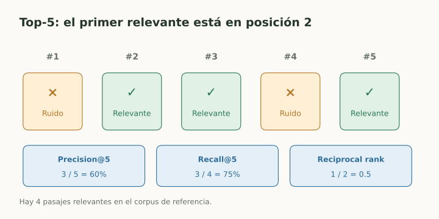
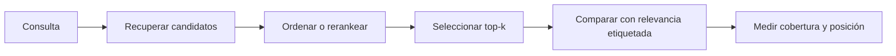

# Métricas de ranking y recuperación

> **En una frase:** recuperar los relevantes y ponerlos arriba son dos objetivos distintos.

## Vista rápida

- Recall@k mide cobertura; precision@k mide limpieza del top-k.
- MRR mira el primer relevante; nDCG evalúa el orden.

## Qué mide cada métrica
Sea $r_i=1$ si el resultado de posición $i$ es relevante, y $|R|$ el total de relevantes etiquetados:

| Métrica | Definición | Pregunta |
|---|---|---|
| Precision@k | $\sum_{i=1}^k r_i/k$ | ¿Qué fracción del top-k sirve? |
| Recall@k | $\sum_{i=1}^k r_i/\lvert R\rvert$ | ¿Qué parte de la evidencia encontré? |
| Hit@k | 1 si hay algún relevante en top-k, 0 si no | ¿Encontré al menos uno? |
| MRR | Media de $1/\text{posición del primer relevante}$ | ¿Qué tan pronto aparece el primero? |
| nDCG@k | DCG@k dividido por el DCG ideal | ¿Ordené bien relevancia graduada? |

Una convención de DCG es $\sum_{i=1}^k g_i/\log_2(i+1)$, con ganancias $g_i$. Otras usan $2^{r_i}-1$: declará la convención.

## Ejemplo
Hay 4 relevantes. El top-5 tiene relevancia binaria $[0,1,1,0,1]$:

**Precision@5 = 60%**, **Recall@5 = 75%**, **Hit@5 = 1**, **reciprocal rank = 1/2**. MRR promedia ese último valor entre consultas; no mide cuántos otros relevantes recuperaste.

## En RAG
Fijá unidad, corpus, filtros y $k$. Un pasaje que comparte palabras con la pregunta puede ser irrelevante. Si no anotaste todos los relevantes, el denominador de recall tiene cobertura limitada.

Sin relevantes, Recall@k no está definido; definí cómo tratar consultas sin respuesta. Sin ganancia ideal, nDCG también necesita una convención.

El recall de ANN mide vecinos aproximados frente a búsqueda exacta; no demuestra relevancia semántica ni corrección de la respuesta.

## Flujo del concepto

## Se conecta con
[[RAG evals]] · [[ANN HNSW]] · [[Búsqueda híbrida y reranking]] · [[Cross-encoder]]

## Fuentes
- [Stanford · evaluación de recuperación](https://nlp.stanford.edu/IR-book/html/htmledition/evaluation-of-ranked-retrieval-results-1.html)
- [scikit-learn · nDCG](https://scikit-learn.org/stable/modules/generated/sklearn.metrics.ndcg_score.html)
