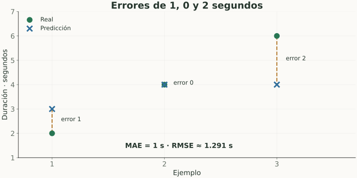

# Métricas de regresión

> **En una frase:** para predecir números, medí el tamaño del error y qué tan útil es frente a una referencia simple.

## Vista rápida

- MAE y RMSE se expresan en las unidades del target.
- R² compara contra predecir la media; puede ser negativo.

| Métrica | Fórmula | Lectura |
|---|---|---|
| MAE | $\frac1n\sum_i\lvert y_i-\hat y_i\rvert$ | Error absoluto medio en unidades originales |
| MSE | $\frac1n\sum_i(y_i-\hat y_i)^2$ | Amplifica errores grandes; unidades al cuadrado |
| RMSE | $\sqrt{\text{MSE}}$ | Unidades originales, sensible a extremos |
| $R^2$ | $1-\frac{\sum_i(y_i-\hat y_i)^2}{\sum_i(y_i-\bar y)^2}$ | Mejora frente a predecir la media observada |

## Ejemplo
Tiempos reales $[2,4,6]$ segundos; predicciones $[3,4,4]$:

- Errores absolutos: $[1,0,2]$ → **MAE = 1 s**.
- Errores cuadrados: $[1,0,4]$ → **MSE = 5/3**.
- **RMSE ≈ 1.291 s**.
- La suma cuadrada alrededor de la media real, 4, es 8 → **$R^2=1-5/8=0.375$**.

$R^2$ puede ser negativo si la predicción es peor que esa referencia. Si el target es constante, la fórmula tiene denominador cero y requiere una convención explícita.

## En Gen AI
Sirven para predictores de latencia o costo. La latencia realmente medida se resume también con percentiles: MAE de un predictor y p95 del servicio contestan preguntas diferentes.

MAPE usa errores porcentuales y se vuelve problemática cerca de cero. No la adoptes para costos o duraciones que pueden ser cero sin revisar esa condición.

## Se conecta con
[[Modelos clásicos y baselines]] · [[Latencia y percentiles]] · [[Evals de rendimiento]]

## Fuentes
- [scikit-learn · métricas de regresión](https://scikit-learn.org/stable/modules/model_evaluation.html)
