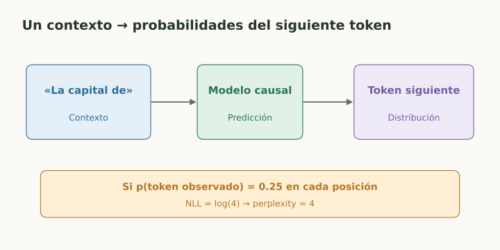

# Objetivos de lenguaje y perplexity

> **En una frase:** predecir texto aprende regularidades del lenguaje; perplexity evalúa esa predicción, no la calidad completa de un asistente.

## Vista rápida

- El modelo aprende probabilidades de tokens condicionadas al contexto.
- Perplexity mide sorpresa sobre texto, no factualidad.

## De texto a targets
Un tokenizer convierte texto en tokens. En un modelo causal, para cada posición el target es el siguiente token:

$$
P(x_1,\ldots,x_T)=\prod_{t=1}^T P(x_t\mid x_{<t}).
$$

La **negative log-likelihood (NLL)** media con logaritmo natural:

$$
L=-\frac1T\sum_t\log P(x_t\mid x_{<t}),
\qquad
\text{perplexity}=e^L.
$$

**Ejemplo:** si cada token observado tiene probabilidad 0.25, $L=\log4$ y perplexity = 4. Es una lectura del grado de sorpresa sobre ese texto, no “cuatro errores”.

## Otros objetivos
Masked language modeling predice tokens ocultos. Denoising aprende a reconstruir datos corrompidos. Modelos generativos de imágenes pueden aprender objetivos de eliminación de ruido: no toda Gen AI predice el siguiente token.

## Cómo comparar
Evaluá texto reservado y controlá tokenizer, corpus, tokens puntuados y contexto usado. Partir el texto en bloques puede quitar contexto y cambiar el resultado. La perplexity causal no se traslada directamente a un modelo enmascarado.

## En una aplicación
Menor perplexity no garantiza factualidad, citas correctas o éxito de tarea. Un texto falso pero habitual puede resultar poco sorprendente para el modelo.

La temperature modifica la distribución al generar: menor suele concentrarla, mayor dispersarla. Cambiar sampling no entrena pesos ni calibra veracidad.

## Se conecta con
[[Calibración y confianza]] · [[Fine-tuning, LoRA y alineación]] · [[RAG evals]] · [[LLMs y elección de modelo]]

## Fuentes
- [Google · introducción a LLMs](https://developers.google.com/machine-learning/crash-course/llm)
- [Hugging Face · perplexity](https://huggingface.co/docs/transformers/perplexity)
