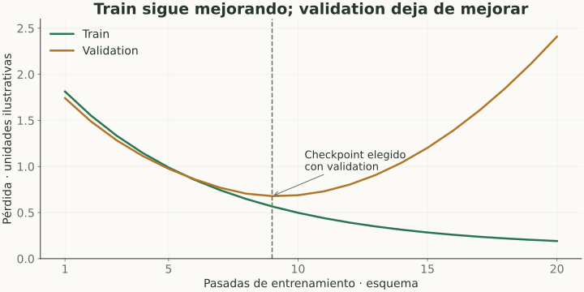

# Overfitting, bias, variance y regularización

> **En una frase:** queremos aprender patrones que funcionen fuera de train, no detalles accidentales de los ejemplos.

## Vista rápida

- Train puede mejorar mientras validation empeora.
- Regularización y early stopping ayudan a generalizar.

| Problema | Señal habitual | Qué investigar |
|---|---|---|
| Underfitting | Train y validation malos | Representación insuficiente, poca capacidad o mala optimización |
| Overfitting | Train mejora, validation empeora | Exceso de ajuste a datos limitados o ruidosos |
| Cambio de distribución | Validation bien, uso real mal | Datos, tareas o población diferentes |

**Bias** es error sistemático por supuestos restrictivos; **variance** es sensibilidad a la muestra de entrenamiento. Este “bias” no es el mismo concepto que sesgo social o discriminación.

## Cómo limitar sobreajuste
Regularizar agrega una penalización: $L_{\text{total}}=L_{\text{datos}}+\lambda\|\theta\|_2^2$ para L2. L1 usa valores absolutos y puede favorecer pesos cero. $\lambda$ controla el compromiso.

**Early stopping:** conservar el checkpoint elegido con validation. **Dropout:** desactivar aleatoriamente activaciones durante entrenamiento. También ayudan datos diversos, menos complejidad y augmentations que preserven la etiqueta.

## Ejemplo Gen AI
Un fine-tuning aprende un formato de respuesta impecable para 200 ejemplos repetidos, pero falla cuando cambia el producto mencionado. Train loss baja no demuestra generalización: evaluá conversaciones y productos separados.

Modificar prompts muchas veces contra el mismo benchmark también puede sobreajustar decisiones al benchmark, aun sin entrenar pesos.

## Qué evitar
No resuelvas una caída en validation mirando el test para elegir el checkpoint. Y no interpretes una curva mala como prueba única de sobreajuste: revisá leakage, etiquetas y optimización.

## Se conecta con
[[Gradiente, backpropagation y optimización]] · [[Fine-tuning, LoRA y alineación]] · [[Experimentos e incertidumbre]]

## Fuentes
- [Google · overfitting](https://developers.google.com/machine-learning/crash-course/overfitting/overfitting)
- [Google · regularización L2](https://developers.google.com/machine-learning/crash-course/overfitting/regularization)
