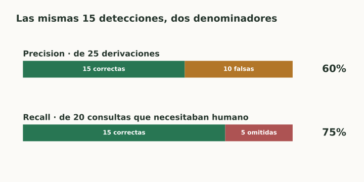

# Precision y recall

> **En una frase:** precision pregunta cuánto de lo marcado era correcto; recall pregunta cuánto de lo necesario encontraste.

## Vista rápida

- Precision: 15 correctas entre 25 alertas = 60%.
- Recall: 15 detectadas entre 20 necesarias = 75%.

## Fórmulas
$$
\text{precision}=\frac{TP}{TP+FP},
\qquad
\text{recall}=\frac{TP}{TP+FN}.
$$

| Métrica | Pregunta | Error que refleja |
|---|---|---|
| Precision | De lo que predije positivo, ¿cuánto era positivo? | Falsos positivos |
| Recall / sensibilidad / TPR | De los positivos reales, ¿cuántos detecté? | Falsos negativos |

## Ejemplo: router a humano
Con TP=15, FP=10 y FN=5:

- **Precision = 15/25 = 60%:** de 25 derivaciones, 15 eran necesarias.
- **Recall = 15/20 = 75%:** encontramos 15 de las 20 consultas que necesitaban ayuda.

Para bajar trabajo innecesario mirá precision. Para evitar consultas sin atención mirá recall.

## En recuperación RAG
Si hay 4 pasajes relevantes y recuperás 5, de los cuales 3 son relevantes: **Precision@5 = 3/5 = 60%**, **Recall@5 = 3/4 = 75%**.

Se conserva la lógica, pero cambia la unidad: pasajes relevantes por consulta, no tickets. Ver [[Métricas de ranking y recuperación]].

## Casos límite
Sin predicciones positivas, precision tiene denominador cero. Sin positivos reales, recall también. Declaralo como no definido o documentá la convención del evaluador.

> [!tip] Para recordar
> **Precision:** limpieza de lo elegido. **Recall:** cobertura de lo que había que encontrar.

## Se conecta con
[[Curvas ROC y AUC]] · [[Curva Precision-Recall y Average Precision]] · [[Desbalance y calidad de etiquetas]] · [[RAG evals]]

## Fuentes
- [Google · precision y recall](https://developers.google.com/machine-learning/crash-course/classification/accuracy-precision-recall)
