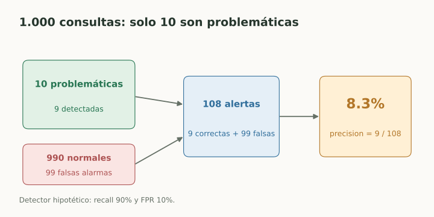

# Probabilidad y estadística para ML

> **En una frase:** probabilidad describe incertidumbre; estadística estima patrones y errores a partir de muestras.

## Vista rápida

- Una clase rara puede producir muchas falsas alarmas.
- Probabilidad condicional y precision dependen de qué observamos.

## Conceptos mínimos
Una **variable aleatoria** representa resultados posibles; una **distribución** asigna probabilidades. La **media** resume el centro, la **varianza** la dispersión, y la **mediana** resiste mejor valores extremos.

Para valores $x_1,\ldots,x_n$: $\bar x=\frac1n\sum_i x_i$. Un percentil p95 deja aproximadamente 95% de los valores por debajo: no equivale al promedio.

La probabilidad condicional $P(A\mid B)$ cambia cuando observamos $B$. Bayes relaciona ambas direcciones:

$$
P(A\mid B)=\frac{P(B\mid A)P(A)}{P(B)}.
$$

## Ejemplo: por qué importa la tasa base
Supongamos 1.000 consultas, 10 realmente problemáticas. Un detector tiene recall 90% y FPR 10%: detecta 9 problemáticas y marca 99 normales. De sus 108 alertas, solo 9 son correctas: precision $\approx8.3\%$.

La frecuencia inicial de positivos, o **prevalencia**, cambia lo que podemos concluir de una alerta. No alcanza con decir que el detector “detecta el 90%”.

## En Gen AI
Un score, una probabilidad de token y una probabilidad de corrección son objetos distintos. La frecuencia observada en una muestra también tiene incertidumbre.

**Correlación** indica asociación; no demuestra causalidad. Si aumentó la calidad tras cambiar un prompt y también cambió el tráfico, necesitamos un experimento controlado para atribuir el efecto.

## Se conecta con
[[Precision y recall]] · [[Calibración y confianza]] · [[Experimentos e incertidumbre]] · [[Latencia y percentiles]]

## Fuentes
- [Deep Learning · probabilidad](https://www.deeplearningbook.org/contents/prob.html)
