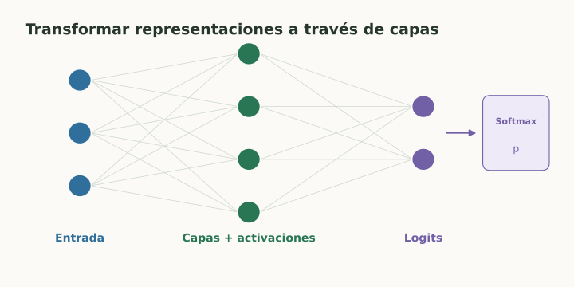
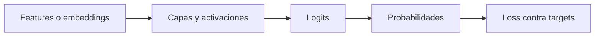

# Redes neuronales y deep learning

> **En una frase:** una red neuronal encadena transformaciones aprendidas para representar relaciones complejas.

## Vista rápida

- Las activaciones no lineales permiten modelar relaciones complejas.
- Los logits se convierten en probabilidades con softmax.

## Una capa
$$
h=\phi(Wx+b).
$$

$W$ y $b$ son parámetros; $\phi$ es una activación no lineal. ReLU usa $\max(0,z)$; otras activaciones, como GELU, suavizan la transformación.

Sin no linealidades, encadenar capas lineales equivale a otra transformación lineal. La profundidad permite componer representaciones; no garantiza mejor generalización.

## De entrada a salida

**Softmax** convierte logits $z_j$ en probabilidades sobre clases:

$$
p_j=\frac{e^{z_j}}{\sum_k e^{z_k}}.
$$

**Ejemplo:** logits $[0,0]$ dan probabilidades $[0.5,0.5]$. Para $[0,\log3]$, dan $[0.25,0.75]$.

## Familias
MLP trabaja sobre vectores; CNN explota patrones locales; RNN procesa secuencias con estado; Transformer usa atención. La arquitectura organiza cómo combinar información.

## En Gen AI
Un LLM transforma tokens en representaciones y produce logits sobre el vocabulario. Backpropagation ajusta sus parámetros durante entrenamiento.

Aprender features reduce la necesidad de diseñarlas manualmente, pero requiere datos y control de generalización. Más parámetros también implican costos de memoria y cómputo.

## Se conecta con
[[Embeddings y aprendizaje de representaciones]] · [[Attention y Transformers]] · [[Objetivos de lenguaje y perplexity]]

## Fuentes
- [Google · redes neuronales](https://developers.google.com/machine-learning/crash-course/neural-networks)
