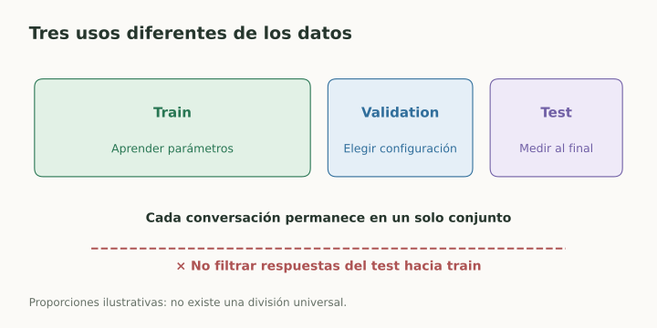
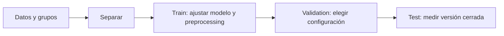

# Train, validation, test y leakage

> **En una frase:** separar los datos evita confundir memorizar ejemplos con generalizar a casos nuevos.

## Vista rápida

- Train aprende; validation elige; test mide al final.
- Separá conversaciones y duplicados para evitar leakage.

| Conjunto | Uso |
|---|---|
| Train | Aprender parámetros y transformaciones |
| Validation / desarrollo | Elegir modelo, prompt, hiperparámetros y umbral |
| Test | Estimar desempeño final tras cerrar las decisiones |

No hay una proporción universal. Necesitás suficientes casos de cada situación importante, sobre todo de la clase rara.

## Cómo separar
**Aleatorio:** ejemplos aproximadamente independientes. **Estratificado:** conservar proporciones de clases. **Por grupos:** mantener cada usuario, cliente o conversación en un solo lado. **Temporal:** pasado para aprender, futuro para evaluar.

Cross-validation repite train/validation en varios folds. Cada fold debe ajustar su propio preprocessing. Si también querés estimar el rendimiento de una búsqueda de hiperparámetros, usá un test independiente o validación anidada.

## Leakage: información que no debería estar disponible

**Ejemplo en Gen AI:** variantes de la misma pregunta aparecen en fine-tuning y test. El resultado parece mejorar, pero puede reflejar memorización. Separá por pregunta original o documento y buscá duplicados semánticos.

Que RAG consulte documentos autorizados de producción puede ser parte legítima de la tarea. Filtrar las respuestas de referencia del test al prompt, al entrenamiento o al índice invalida esa evaluación.

## Se conecta con
[[Overfitting, bias, variance y regularización]] · [[Fine-tuning, LoRA y alineación]] · [[Golden dataset]] · [[Experimentos e incertidumbre]]

## Fuentes
- [scikit-learn · cross-validation](https://scikit-learn.org/stable/modules/cross_validation.html)
- [scikit-learn · errores comunes](https://scikit-learn.org/stable/common_pitfalls.html)
