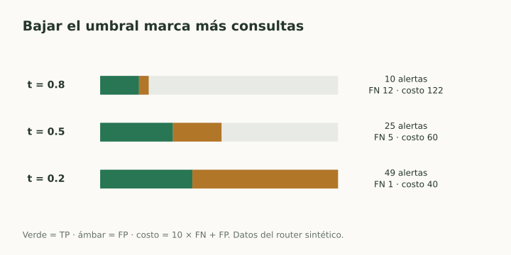
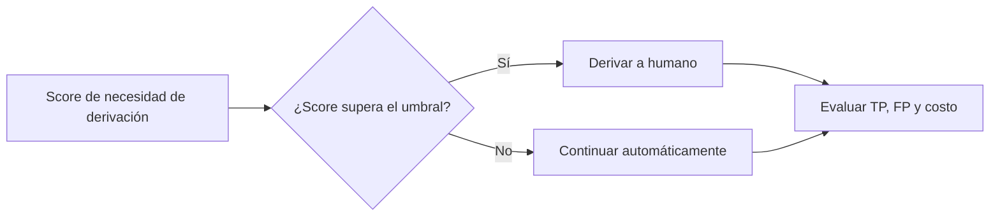

# Umbrales y costo de errores

> **En una frase:** el score ordena casos; el umbral decide qué acción tomar.

## Vista rápida

- Bajar el umbral detecta más positivos y suma falsas alertas.
- Elegí en validation según errores, costo y capacidad humana.

## Una regla explícita
Si un score alto indica mayor necesidad de derivación:

$$
\hat y=\mathbf1[s(x)\ge t].
$$

Al bajar $t$, seleccionás más casos: TP y FP no disminuyen, y recall no disminuye. Precision suele bajar, pero no tiene por qué hacerlo de forma monótona.

## Ejemplo: mismo modelo, distintos puntos
Sobre 100 consultas, con 20 positivos y 80 negativos:

| Umbral | TP | FP | FN | TN | Precision | Recall |
|---|---|---|---|---|---|---|
| 0.8 | 8 | 2 | 12 | 78 | 80% | 40% |
| 0.5 | 15 | 10 | 5 | 70 | 60% | 75% |
| 0.2 | 19 | 30 | 1 | 50 | 38.8% | 95% |

Si cada FN cuesta 10 unidades y cada FP cuesta 1:

$$
C=10FN+FP.
$$

Los costos son **122, 60 y 40**, respectivamente. Entre estos tres candidatos, 0.2 minimiza ese costo; también deriva 49 casos, lo que podría superar la capacidad humana.

## Cómo elegir
Elegí en validation según costos, capacidad y restricciones, por ejemplo “recall ≥ 90%”. Después medí la decisión cerrada en test.

Con probabilidades calibradas y solo costos $c_{FP},c_{FN}$, una regla óptima bajo esos supuestos usa $t=c_{FP}/(c_{FP}+c_{FN})$. Otras restricciones cambian la decisión.

## En Gen AI
Un umbral de similitud para responder o abstenerse también necesita casos etiquetados. No adoptes 0.8 como regla universal.

## Flujo del concepto

## Se conecta con
[[Curvas ROC y AUC]] · [[Calibración y confianza]] · [[Control humano y permisos]] · [[Caso práctico - Métricas de un router Gen AI]]

## Fuentes
- [scikit-learn · umbral de decisión](https://scikit-learn.org/stable/modules/classification_threshold.html)
