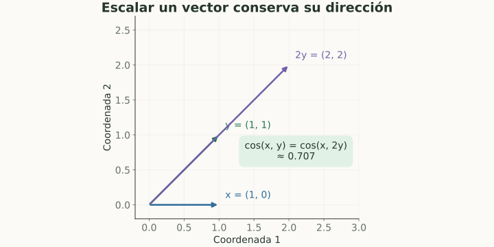

# Álgebra lineal para embeddings

> **En una frase:** vectores y matrices permiten representar datos, comparar embeddings y transformar representaciones.

## Vista rápida

- Un embedding es un vector: una representación aprendida.
- Coseno mide alineación, no probabilidad de corrección.

| Objeto | Qué representa | Ejemplo |
|---|---|---|
| Escalar | Un número | Un score de relevancia |
| Vector $x\in\mathbb R^d$ | Una lista de $d$ coordenadas | Un embedding |
| Matriz $X\in\mathbb R^{n\times d}$ | $n$ vectores como filas | Un lote de documentos |
| Tensor | Un arreglo con varios ejes | Lote × tokens × dimensión |

## Tres operaciones fundamentales
Producto punto: $x\cdot y=\sum_i x_i y_i$. Norma: $\|x\|_2=\sqrt{\sum_i x_i^2}$. Similitud coseno:

$$
\cos(x,y)=\frac{x\cdot y}{\|x\|_2\|y\|_2}.
$$

**Ejemplo:** $x=(1,0)$ e $y=(1,1)$ → producto punto $1$, normas $1$ y $\sqrt2$, coseno $\approx0.707$. Si duplicás $y$, el producto punto se duplica, pero el coseno sigue igual.

La transformación $XW$ combina features. Si $X$ tiene forma $n\times d$ y $W$ tiene forma $d\times h$, el resultado es $n\times h$.

## En Gen AI
Coseno mide alineación de representaciones; no es una probabilidad de que la respuesta sea correcta. Si los vectores tienen norma uno, producto punto y coseno coinciden. El vector cero no tiene coseno definido.

Una dimensión de embedding no equivale necesariamente a una característica interpretable. Los vectores de modelos distintos no comparten automáticamente el mismo espacio.

## Se conecta con
[[Embeddings y aprendizaje de representaciones]] · [[Modelos de embedding]] · [[Vector DB]] · [[Attention y Transformers]]

## Fuentes
- [Deep Learning · álgebra lineal](https://www.deeplearningbook.org/contents/linear_algebra.html)
