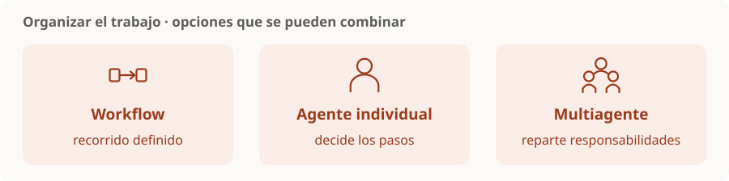

# Agente individual vs workflow vs multiagente

> **En una frase:** elegí cuánto del recorrido define el código y cuántos agentes necesitás para resolver la tarea.

## Comparación rápida
| Opción | Quién organiza los pasos | Buen punto de partida cuando… |
|---|---|---|
| Workflow | El código define el recorrido | Los pasos son conocidos y repetibles |
| Agente individual | Un agente decide qué hacer y qué tool usar | El camino depende de lo que va encontrando |
| Multiagente | Varios agentes reparten responsabilidades | Hay partes separables o especialidades con contextos distintos |

**Ejemplos:** extraer campos y validarlos → workflow; investigar un pedido con varias tools → agente; repartir una investigación por áreas → multiagente.

Son dimensiones que se pueden combinar: un workflow puede coordinar varios agentes. Workflow vs agente describe el control del recorrido; individual vs multiagente describe cuántos participan. [Patrones de agentes](https://www.anthropic.com/engineering/building-effective-agents).

> [!TIP] Criterio
> Empezá por la solución más simple que alcance. Agregá autonomía o agentes cuando las evals justifiquen el costo de coordinación.

## Dos patrones del mapa
[[Router handoff]] deriva el control. [[Orquestador workers]] reparte y reúne resultados. Son patrones útiles, no una lista exhaustiva.

[[Tools y function calling]] · [[Contexto, memoria y estado]] · [[Multi-agent evals]]
