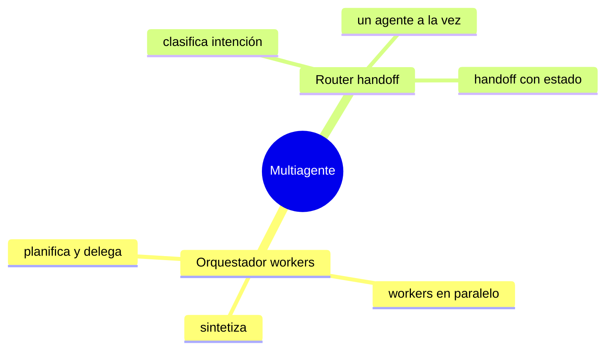

# Multiagente

> **En una frase:** cuando un solo agente no alcanza, hay dos formas de repartir el trabajo: uno que coordina a varios (orquestador) o uno que deriva al especialista correcto (router).

## Mapa


## Orden sugerido
1. [[Router handoff]] · el más simple: elegir a quién le toca
2. [[Orquestador workers]] · dividir, ejecutar en paralelo, juntar

## Estado de los nodos
```dataview
TABLE WITHOUT ID file.link AS nodo, estado
FROM "multiagente" WHERE tipo != "mapa" SORT file.name
```

[[Multiagente.canvas|Abrir el canvas de Multiagente]] · para ver solo este subgrafo: clic derecho en esta nota → *Open local graph*.
