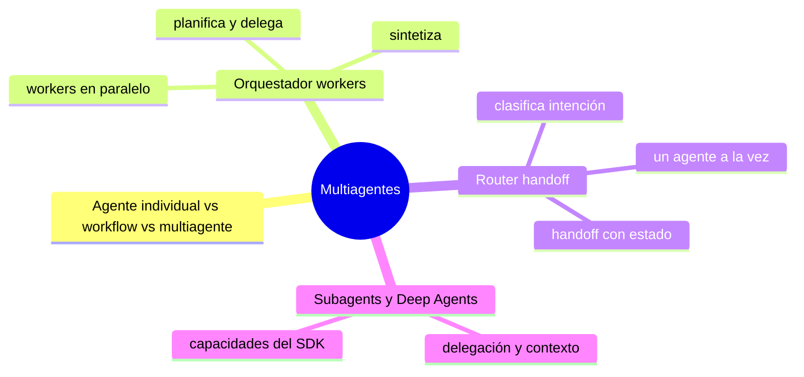

# Multiagentes

> **En una frase:** primero decidí si necesitás un workflow, un agente o varios; después elegí cómo repartir el trabajo.

## Mapa


## Orden sugerido
1. [[Agente individual vs workflow vs multiagente]] · elegir el nivel de autonomía y reparto
2. Compará [[Router handoff]] (transferir control) con [[Orquestador workers]] (delegar y reunir resultados)
3. Elegí según la tarea; ninguno exige usar RAG
4. [[Subagents y Deep Agents]] · delegación y capacidades del SDK

## Subagents y Deep Agents
[[Subagents]] → [[Deep Agents]]. Sus pruebas están en [[Evals]]: [[Evaluación de subagentes]] y [[Evals de Deep Agents]].

[[Tools y function calling]] vive en [[Fundamentos]]: lo usan tanto uno como varios agentes. [[Seguridad]] define permisos y controles para ambos.

## Estado de los nodos
```dataview
TABLE WITHOUT ID file.link AS nodo, estado
FROM "multiagente" WHERE tipo != "mapa" SORT orden
```

[[Multiagentes.canvas|Abrir el canvas de Multiagentes]] · para ver solo este subgrafo: clic derecho en esta nota → *Open local graph*.

