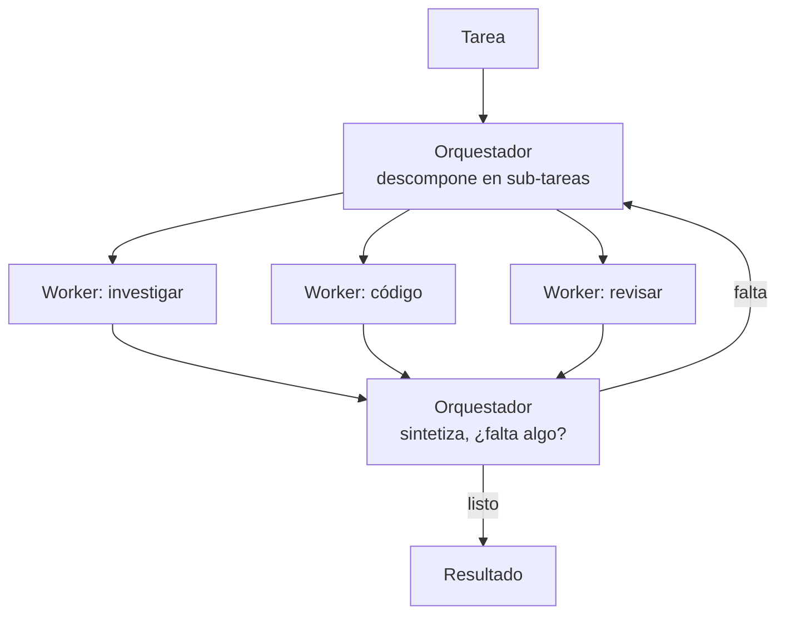

# Orquestador / workers

> **En una frase:** un agente planifica y reparte, varios agentes especializados ejecutan en paralelo, y el orquestador junta los resultados. Divide y conquista, con LLMs.

## Diagrama

## Cuándo sí / cuándo no
| Usalo cuando | Evitalo cuando |
|---|---|
| La tarea se parte en pedazos independientes | Un solo agente con buenas tools lo resuelve |
| Cada pedazo necesita contexto o tools distintos | Los pedazos comparten mucho estado y se pisan |
| Podés pagar N llamadas en paralelo | Latencia y costo son la restricción |

## Decisiones de diseño
- **Qué ve cada worker**: solo su sub-tarea y lo mínimo de contexto. Pasarle todo es el error más común.
- **Formato de retorno**: estructurado (`resultado`, `confianza`, `fuentes`) para que el orquestador decida sin releer todo.
- **Fallas**: un worker falla → reintentar solo ese, no todo el plan.

## Se conecta con
Contrasta con [[Router handoff]]: el router elige *uno*, el orquestador coordina *varios*. Se mide con [[Multi-agent evals]].

[[Subagents]] desarrolla el contrato de delegación; [[Deep Agents]] ofrece una implementación integrada.
