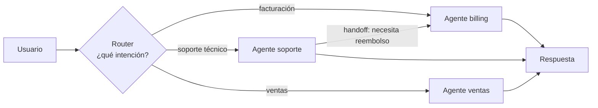

# Router / handoff

> **En una frase:** un clasificador (LLM o modelo chico) mira la intención y deriva la conversación al agente especialista correcto. El handoff pasa el control y el estado, no una copia.

## Diagrama

La flecha soporte → billing es un **handoff**: cambia el agente activo, y el historial y el estado viajan con él.

## Router vs orquestador
| | Router / handoff | [[Orquestador workers]] |
|---|---|---|
| Agentes activos | 1 a la vez | Varios a la vez |
| Quién decide | El agente actual puede derivar | Solo el orquestador |
| Latencia | Baja | Alta |
| Típico en | Chatbots, soporte | Investigación, tareas largas |

## Decisiones de diseño
- **Router barato**: un modelo chico con few-shot alcanza y ahorra latencia.
- **Qué viaja en el handoff**: resumen del estado + últimos N turnos, no todo el historial.
- **Fallback**: siempre un agente "general" para lo que no matchea.
- **Ping-pong**: límite de handoffs por conversación, o dos agentes se pasan al usuario para siempre.

## Se conecta con
Se mide con [[Multi-agent evals]] (¿derivó al agente correcto? ¿cuántos handoffs?). El router de [[RAG agéntico]] es la misma idea aplicada a fuentes.
