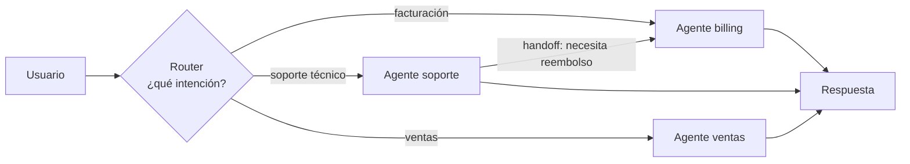

# Router / handoff

> **En una frase:** el router elige un destino; el handoff cambia quién lleva la conversación y entrega el contexto necesario.

## Diagrama

La flecha soporte → billing es un **handoff**: cambia el agente activo. Qué historial y estado recibe depende del contrato y la implementación.

## Router vs orquestador
| | Router / handoff | [[Orquestador workers]] |
|---|---|---|
| Agentes activos | 1 a la vez | Varios a la vez |
| Quién decide | El agente actual puede derivar | Solo el orquestador |
| Latencia | Depende de derivaciones y trabajo posterior | Depende de coordinación y paralelismo |
| Típico en | Chatbots, soporte | Investigación, tareas largas |

## Decisiones de diseño
- **Router barato**: probá reglas o un modelo chico con ejemplos; verificá calidad y latencia con tus casos.
- **Qué viaja en el handoff**: preservá IDs, decisiones, restricciones y permisos; seleccioná el historial necesario.
- **Fallback**: si no hay destino claro, pedí aclaración, derivá a una persona o usá un agente general autorizado.
- **Ping-pong**: límite de handoffs por conversación, o dos agentes se pasan al usuario para siempre.

## Se conecta con
Se mide con [[Multi-agent evals]] (¿derivó al agente correcto? ¿cuántos handoffs?). El router de [[RAG agéntico]] es la misma idea aplicada a fuentes.

[Referencia de patrones](https://www.anthropic.com/engineering/building-effective-agents).
