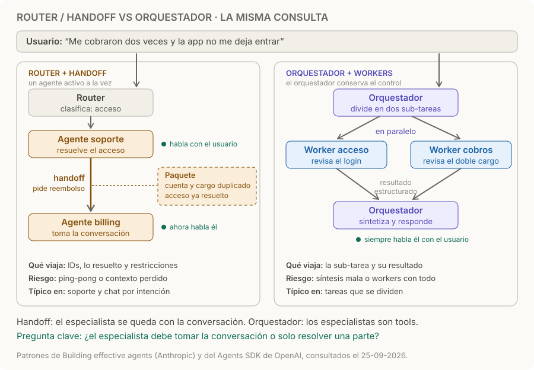

# Router / handoff

> **En una frase:** el router elige a qué agente va la conversación; el handoff le pasa el control a otro agente junto con el contexto necesario.

## Cómo funciona
1. **Clasificar.** El router decide la intención y elige un destino. Puede usar reglas, un modelo chico o un LLM con ejemplos. Funciona bien cuando las categorías son claras y la clasificación es confiable. [Building effective agents](https://www.anthropic.com/engineering/building-effective-agents).
2. **Un agente activo.** El agente elegido conversa con el usuario con sus propias instrucciones y tools.
3. **Handoff.** Si el caso sale de su área, transfiere el control a otro especialista, que se queda con la conversación.
4. **Paquete.** Viajan IDs, lo ya resuelto, decisiones, restricciones y la intención pendiente; no necesariamente todo el historial.

## Router vs orquestador
| | Router / handoff | [[Orquestador workers]] |
|---|---|---|
| Agentes activos | Uno a la vez | Varios, a veces en paralelo |
| Quién habla con el usuario | El agente activo; cambia en cada handoff | Siempre el orquestador |
| Quién decide | El router, y después el agente actual puede derivar | Solo el orquestador |
| Qué viaja | El paquete de handoff | La sub-tarea y su resultado estructurado |
| Típico en | Soporte y chat por intención | Investigación y tareas que se dividen |

El Agents SDK de OpenAI lo resume así: usá handoff cuando el especialista debe quedarse con la conversación, y agentes como tools cuando solo resuelve una parte acotada. [Orquestación multiagente](https://openai.github.io/openai-agents-python/multi_agent/).

## Ejemplo
“Me cobraron dos veces y la app no me deja entrar”:
- El router elige **soporte** por “no me deja entrar”. Soporte resuelve el acceso.
- Soporte hace **handoff** a **billing** con la cuenta, el cargo duplicado y “acceso ya resuelto”. Billing no vuelve a preguntar por el login y gestiona el reembolso con el usuario.
- Con un orquestador, las dos partes se resolverían en paralelo y respondería una sola voz. Conviene el handoff si billing necesita conversar (pedir datos, confirmar el reembolso); conviene el orquestador si solo devuelve un resultado.

## Decisiones de diseño
- **Router barato:** probá reglas o un modelo chico con ejemplos; verificá precisión por intención y latencia con tus casos.
- **Consultas con dos intenciones:** definí cuál va primero o detectalas y derivá a un orquestador.
- **Qué viaja en el handoff:** preservá IDs, decisiones, restricciones y permisos aplicables; seleccioná el historial necesario.
- **Fallback:** si no hay destino claro, pedí aclaración, derivá a una persona o usá un agente general autorizado.
- **Ping-pong:** límite de handoffs por conversación; si no, dos agentes se pasan al usuario para siempre.

## Cuándo sí / cuándo no
| Usalo cuando | Evitalo cuando |
|---|---|
| Las intenciones son categorías claras y el router las distingue bien | Las consultas mezclan varias tareas que conviene resolver juntas |
| Cada especialista necesita conversar con el usuario | El especialista solo aporta un resultado: mejor como tool de un orquestador |
| Querés instrucciones, tools y permisos separados por área | Un solo agente con buenas tools ya resuelve todas las áreas |

## Trampas
- **Contexto perdido:** el segundo agente vuelve a preguntar lo que el usuario ya dijo. Probalo con casos multi-turno en [[Multi-agent evals]].
- **Ping-pong:** dos agentes se derivan entre sí porque cada uno cree que el caso es del otro.
- **Privilegios que viajan:** el handoff pasa contexto, no permisos. El paquete no lleva credenciales, y billing usa sus propias autorizaciones: [[Control humano y permisos]].
- **Router que adivina:** con baja confianza, pedí aclaración en lugar de elegir. Medí la precisión por intención, no solo la global.

> [!TIP] Para recordar
> **El handoff pasa la conversación; el orquestador reparte trabajo y se la queda.**

## Practicá
> [!question]- En el ejemplo, ¿qué debería llevar el paquete de handoff de soporte a billing, y qué no?
> Debería llevar el ID de cuenta, el cargo duplicado (monto, fecha e ID de transacción), que el acceso ya se resolvió, las restricciones del usuario y la intención pendiente: el reembolso. No debería llevar todo el historial si no hace falta, ni credenciales o tokens de soporte: billing usa sus propias autorizaciones.

> [!question]- El 30 % de las conversaciones pasa por tres o más handoffs. ¿Qué mirás?
> Las trayectorias: qué pares de agentes se derivan entre sí. Suele ser un límite difuso entre áreas o un router que clasifica mal la primera intención. Medí la precisión del router por intención, poné un límite de handoffs con fallback a una persona y aclará qué le corresponde a cada agente. Cada ping-pong real se vuelve un caso del [[Golden dataset]].

> [!question]- Te piden un informe que compare tres proveedores. ¿Router u orquestador?
> Orquestador: la tarea se divide en sub-tareas independientes, una por proveedor; ninguna necesita conversar con el usuario y hay que sintetizar un resultado. Un router elegiría un solo especialista y se perdería la comparación.

## Se conecta con
[[Orquestador workers]] · [[Agente individual vs workflow vs multiagente]] · [[Multi-agent evals]] · [[RAG agéntico]] (el mismo patrón aplicado a fuentes) · [[Contexto, memoria y estado]]
