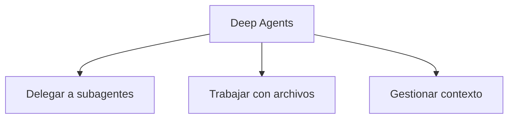

# Deep Agents

> **En una frase:** un SDK de LangChain que reúne capacidades para ejecutar agentes en tareas de varios pasos.

## Tres ideas
- **Punto de partida:** en TypeScript, `createDeepAgent` del paquete `deepagents` permite configurar el agente, sus tools y subagentes.
- **Capacidades:** integra herramientas de archivos, delegación, resumen y descarga de resultados grandes; planificación y skills son opcionales.
- **Decisión:** consideralo cuando esas capacidades encajen con tu tarea. Componer agentes directamente permite diseñar una coordinación más específica.

**Ejemplo:** investigar una solicitud extensa, guardar evidencia en archivos de trabajo y delegar revisiones de documentos.

> [!TIP] Para recordar
> “Deep” no exige muchos niveles de agentes. El SDK tampoco demuestra por sí solo calidad, aislamiento ni recuperación correcta.

**Practicá:** ¿qué capacidad concreta del SDK necesitarías además de delegar?

[Documentación oficial](https://docs.langchain.com/oss/javascript/deepagents/overview) · [[Runtime de agentes]] · [[Evaluación de subagentes]] · [[Evals de Deep Agents]]
