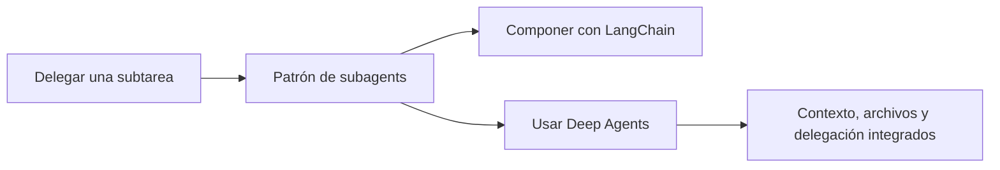

# Subagents y Deep Agents

> **En una frase:** subagents es un patrón de delegación; Deep Agents es un SDK que lo integra con otras capacidades.



## Fichas breves
| Nota | Pregunta |
|---|---|
| [[Subagents]] | ¿Qué recibe, ejecuta y devuelve un subagente? |
| [[Deep Agents]] | ¿Qué capacidades trae el SDK? |

**Ejemplo:** revisar pólizas y antecedentes puede repartirse entre subagentes. Deep Agents es una opción para construir esa solución.

> [!TIP] Para recordar
> Podés usar subagentes sin Deep Agents. Elegí según las capacidades y el control que necesites.

## Evaluación en Evals
[[Evaluación de subagentes]] → [[Decisión de delegar]] → [[Casos de eval de subagentes]] → [[Evals de Deep Agents]].

## Estado de los nodos
```dataview
TABLE WITHOUT ID file.link AS nodo, estado
FROM "multiagente/subagents" WHERE tipo != "mapa" SORT orden
```

[[Multiagentes.canvas|Abrir el canvas de Multiagentes]] · [[Multiagentes]] · [[Runtime de agentes]] · [[Evals]]
