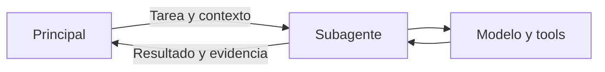

# Subagents

> **En una frase:** el principal delega una tarea acotada; el subagente usa sus herramientas y devuelve un resultado.

## Tres ideas
- **Contrato:** definí objetivo, contexto, permisos, presupuesto y formato de salida. El subagente no conoce automáticamente toda la conversación.
- **Invocación:** en LangChain podés envolver un agente como una tool. Por defecto, cada invocación comienza con estado nuevo; la persistencia requiere configuración.
- **Control:** puede trabajar en paralelo si la tarea es independiente. En este patrón devuelve el control al principal; un handoff lo transfiere a otro agente.

**Ejemplo:** el principal pide revisar exclusiones de una póliza y recibe hallazgos con páginas fuente.

> [!TIP] Para recordar
> Aislar el contexto no aísla automáticamente archivos, permisos ni efectos de las tools.

## Practicá
> [!question]- ¿Qué información mínima enviarías al especialista y qué debería devolverte?
> Enviá el objetivo, los IDs y documentos que necesita (cliente, póliza, versión), las restricciones que aplican, sus permisos, el presupuesto y el formato de salida. No hace falta la conversación completa: cada dato extra es ruido. Debería devolver hallazgos estructurados con su evidencia (documento y página), un estado (completo, parcial o fallido), qué no pudo verificar y qué acciones ejecutó. Sin estado ni evidencia, el principal no distingue “no hay exclusiones” de “no pude leer el PDF”.

## Se conecta con
[Patrón en LangChain](https://docs.langchain.com/oss/javascript/langchain/multi-agent/subagents) · [[Ejecución y recuperación]] · [[Deep Agents]]
