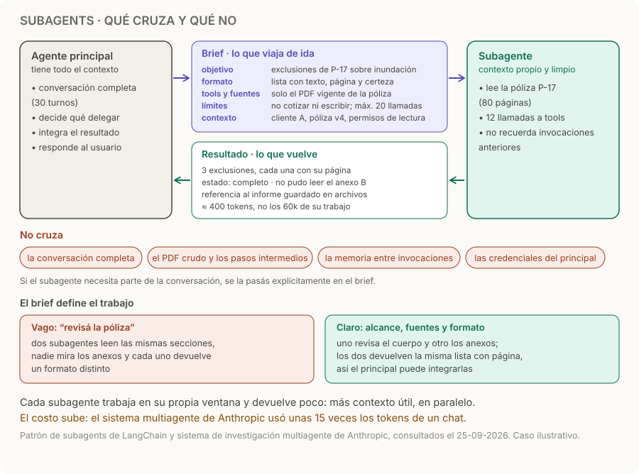

# Subagents

> **En una frase:** el principal delega una tarea acotada; el subagente usa sus herramientas y devuelve un resultado.

## Cómo funciona
1. **El principal decide delegar** una subtarea acotada, idealmente independiente de las demás: [[Decisión de delegar]].
2. **Envía un brief.** Anthropic pide cuatro cosas para cada subagente: objetivo, formato de salida, qué tools y fuentes usar, y límites claros de la tarea. A eso sumale IDs, permisos y presupuesto. [Sistema multiagente de Anthropic](https://www.anthropic.com/engineering/multi-agent-research-system).
3. **El subagente trabaja en su propio contexto.** Se invoca como una tool y, por defecto, no guarda estado: cada invocación empieza con la ventana limpia. Si necesita parte de la conversación, se la pasás. [Subagents en LangChain](https://docs.langchain.com/oss/javascript/langchain/multi-agent/subagents).
4. **Devuelve un resultado compacto** al principal, no al usuario: hallazgos con evidencia, un estado y lo que no pudo verificar. Si el trabajo es grande, lo guarda en archivos y devuelve una referencia, en lugar de pasarlo entero por la conversación.
5. **El principal integra y responde.** Puede lanzar varios subagentes en el mismo turno si las tareas son independientes. A diferencia de un handoff, el control vuelve al principal: [[Router handoff]].

## Qué va en el brief
| Campo | Ejemplo | Si falta |
|---|---|---|
| Objetivo | Exclusiones de P-17 sobre inundación | Trabajo duplicado o fuera de tema |
| Formato de salida | Lista con texto, página y certeza | El principal no puede integrar ni comparar |
| Tools y fuentes | Solo el PDF vigente de la póliza | Usa una versión vieja o datos de otro cliente |
| Límites | No cotizar ni escribir; máximo 20 llamadas | Efectos no deseados y costo sin techo |
| Contexto y permisos | Cliente A, póliza v4, solo lectura | Pregunta lo que ya se sabe o accede de más |

## Ejemplo
El principal pide las exclusiones de P-17 sobre inundación. El subagente lee las 80 páginas con 12 llamadas a tools y devuelve tres exclusiones con su página, “no pude leer el anexo B” y una referencia al informe guardado: unos 400 tokens en lugar de los 60.000 de su trabajo. El principal integra eso con el resto de la conversación y responde. Números ilustrativos, los mismos del diagrama.

## Trampas
- **Brief vago.** En el sistema de Anthropic, una instrucción como “investigá la escasez de semiconductores” hizo que dos subagentes repitieran el mismo trabajo mientras otro miraba otra época. Fijá alcance y fuentes para que no se solapen.
- **Devolver todo.** Pasar el PDF crudo o todos los pasos intermedios anula el contexto aislado y llena la ventana del principal: [[Presupuesto de contexto]].
- **Resultado sin estado.** El principal no distingue “no hay exclusiones” de “no pude leer el PDF”.
- **Aislar el contexto no aísla los efectos.** Archivos, permisos y tools con efectos siguen compartidos: [[Sandboxing y aislamiento]] y [[Ejecución y recuperación]].
- **Costo.** Anthropic midió que sus agentes usan unas 4 veces los tokens de un chat, y su sistema multiagente unas 15. Delegá cuando el resultado lo justifique: [[Métricas de subagentes]].

> [!TIP] Para recordar
> **Brief claro de ida, resultado compacto con evidencia y estado de vuelta; el resto se queda en el subagente.**

## Practicá
> [!question]- ¿Qué información mínima enviarías al especialista y qué debería devolverte?
> Enviá el objetivo, los IDs y documentos que necesita (cliente, póliza, versión), las restricciones que aplican, sus permisos, el presupuesto y el formato de salida. No hace falta la conversación completa: cada dato extra es ruido. Debería devolver hallazgos estructurados con su evidencia (documento y página), un estado (completo, parcial o fallido), qué no pudo verificar y qué acciones ejecutó. Sin estado ni evidencia, el principal no distingue “no hay exclusiones” de “no pude leer el PDF”.

> [!question]- ¿Cuándo le pasarías la conversación completa a un subagente?
> Casi nunca. Si la tarea depende de algo dicho en la conversación, como una preferencia o una restricción del usuario, pasale eso en el brief, resumido y con su fuente. La conversación completa cuesta tokens en cada invocación, suma ruido y puede traer datos que el subagente no debería ver. Tiene sentido solo cuando la tarea es justamente interpretar la conversación, por ejemplo resumirla.

> [!question]- Lanzás tres subagentes en paralelo para revisar una póliza de 300 páginas. ¿Cómo repartís el trabajo y qué vigilás?
> Repartí por alcance sin solapamiento, por ejemplo cuerpo, anexos y endosos, y pedí a los tres el mismo formato de salida para poder integrar. Poné un límite de llamadas a cada uno y hacé que el principal busque contradicciones y duplicados al juntar. Vigilá el costo, porque son tres ventanas completas, y compará contra un solo agente con presupuesto parecido: [[Evaluación de subagentes]].

## Se conecta con
[[Decisión de delegar]] · [[Router handoff]] · [[Orquestador workers]] · [[Deep Agents]] · [[Evaluación de subagentes]] · [[Ejecución y recuperación]]
