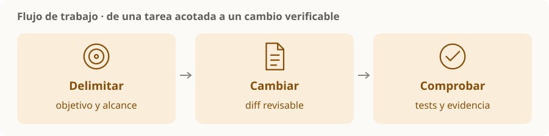

# Flujo de trabajo y validación

> **En una frase:** dar una tarea acotada, producir un cambio revisable y demostrar que cumple lo pedido.

## Antes, durante y después
| Momento | Qué dejar claro |
|---|---|
| Antes | Problema, alcance, restricciones y criterio de terminado |
| Durante | Cambios pequeños, decisiones relevantes y bloqueos |
| Después | Qué cambió, pruebas realizadas y limitaciones pendientes |

**Ejemplo:** “corregir el cálculo del descuento y cubrir el caso de cantidades negativas” delimita mejor la tarea que “mejorar el checkout”.

## Qué comprobar
- El **diff** corresponde al objetivo y no incluye cambios accidentales.
- Los **tests** relevantes verifican comportamiento, incluidos los bordes que importan.
- **Lint, tipos y build**, cuando correspondan, siguen pasando.
- La descripción de la **PR** permite entender problema, solución y validación.

Las comprobaciones obligatorias y revisiones pueden formar parte de las reglas de integración del repositorio. [Ramas protegidas en GitHub](https://docs.github.com/en/repositories/configuring-branches-and-merges-in-your-repository/managing-protected-branches/about-protected-branches).

> [!TIP] Para recordar
> “El agente terminó” no equivale a “el cambio está validado”. Separá pruebas ejecutadas de comprobaciones que no se pudieron hacer.

[[Instrucciones del repositorio]] · [[Hooks de desarrollo]] · [[Revisión de PR con agentes]]
