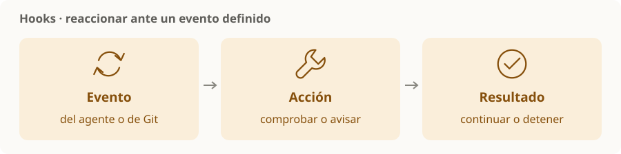

# Hooks de desarrollo

> **En una frase:** automatizar una acción cuando ocurre un evento, para no depender de recordarla en cada tarea.

## No todos los hooks son iguales
| Tipo | Qué los dispara | Ejemplo |
|---|---|---|
| Del agente | Eventos que expone la herramienta | Validar una llamada antes de ejecutarla |
| De Git | Operaciones del repositorio | Comprobar formato antes de un commit |
| CI | Eventos del servicio de integración | Ejecutar tests cuando cambia una PR |

CI aparece como comparación: un workflow de CI no es un hook del agente. Los eventos, la configuración y la posibilidad de bloquear dependen de cada mecanismo. [Hooks de Git](https://git-scm.com/docs/githooks).

Claude Code ofrece hooks de comandos y también tipos que consultan modelos. Un evento automático no vuelve determinística una decisión tomada por un LLM. [Hooks de Claude Code](https://code.claude.com/docs/en/hooks-guide).

## Qué conviene automatizar
- Validaciones rápidas y repetibles.
- Avisos claros cuando termina una tarea.
- Controles sobre acciones concretas, donde el evento permita bloquearlas.

> [!TIP] Para recordar
> Hook rápido y visible; comprobaciones costosas en el lugar adecuado. Evitá bucles y efectos inesperados. Si una regla debe impedir integrar código, comprobala también en CI con los controles del repositorio.

[[Flujo de trabajo y validación]] · [[Skills compartidas]]
