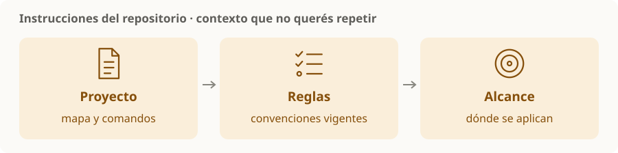

# Instrucciones del repositorio

> **En una frase:** dejar por escrito lo que un agente necesita saber para trabajar bien en este proyecto sin repetirlo en cada conversación.

## AGENTS.md y CLAUDE.md
| Archivo | Para recordar |
|---|---|
| `AGENTS.md` | Codex carga instrucciones del repositorio y admite reglas por directorio |
| `CLAUDE.md` | Claude Code usa este archivo; puede importar un `AGENTS.md` común |

No asumas que ambos productos descubren archivos con las mismas reglas. Para compartir la base, Claude Code admite `@AGENTS.md` dentro de `CLAUDE.md`. [Codex](https://learn.chatgpt.com/docs/agent-configuration/agents-md) · [Claude Code](https://code.claude.com/docs/en/memory).

## Qué conviene incluir
- **Mapa del proyecto:** dónde están las partes importantes.
- **Comandos reales:** cómo ejecutar, validar y probar.
- **Convenciones:** patrones, nombres y decisiones que el código no explica solo.
- **Límites:** compatibilidad, archivos generados y acciones que requieren autorización.

**Ejemplo:** “los handlers usan el servicio de dominio; los archivos generados se actualizan con el generador”.

> [!TIP] Para recordar
> Pocas reglas concretas, vigentes y sin contradicciones. Las instrucciones orientan al agente; las comprobaciones de código hacen verificable el resultado.

Los procedimientos largos van en [[Skills compartidas]]. La evidencia del cambio va en [[Flujo de trabajo y validación]].
