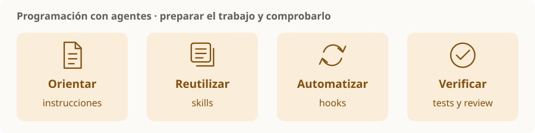

# Programación con agentes

> **En una frase:** preparar el repositorio y el flujo de trabajo para que los agentes produzcan cambios claros, verificables y fáciles de revisar.



## Seis piezas
| Nodo | Qué mejora |
|---|---|
| [[Instrucciones del repositorio]] | AGENTS.md / CLAUDE.md: convenciones y contexto estable |
| [[Skills compartidas]] | Procedimientos reutilizables para tareas frecuentes |
| [[Hooks de desarrollo]] | Controles disparados por eventos |
| [[Flujo de trabajo y validación]] | Alcance claro, cambios pequeños y evidencia |
| [[Worktrees y trabajo paralelo]] | Separar cambios y coordinar responsabilidades |
| [[Revisión de PR con agentes]] | Detectar defectos antes de integrar |

## Qué va en cada lugar
**Regla estable → instrucciones. Procedimiento repetido → skill. Evento automático → hook. Comprobación del resultado → tests, CI y review.**

**Ejemplo:** “esta API debe conservar compatibilidad” es una regla; “cómo revisar una API” es una skill; ejecutar una comprobación al cambiar código es una automatización.

Este bloque se puede estudiar por separado. Documenta prácticas; no configura agentes ni instala automatizaciones en el vault. Las diferencias entre productos se contrastaron con sus fuentes oficiales el **13-09-2026**.

## Estado de los nodos
```dataview
TABLE WITHOUT ID file.link AS nodo, estado
FROM "programacion-agentes" WHERE tipo != "mapa" SORT orden
```

[[Programación con agentes.canvas|Abrir el canvas de Programación con agentes]]
