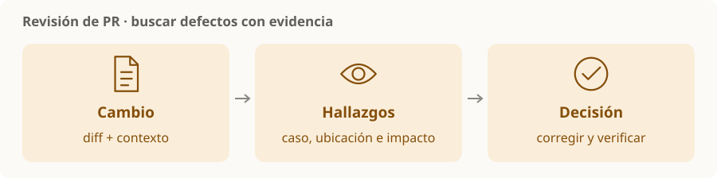

# Revisión de PR con agentes

> **En una frase:** usar el agente para encontrar defectos concretos en un cambio y dar evidencia que permita decidir qué corregir.

## Qué debe recibir el revisor
- Objetivo de la PR y rama base de comparación.
- Diff y contexto necesario del código afectado.
- Convenciones del repositorio y resultados de tests.

## Qué vale la pena buscar
| Área | Pregunta |
|---|---|
| Correctitud | ¿Hay un caso en que el cambio falle? |
| Regresiones | ¿Rompe un comportamiento o contrato existente? |
| Seguridad | ¿Introduce acceso indebido o exposición de datos? |
| Validación | ¿Las pruebas cubren el comportamiento que cambió? |

**Hallazgo útil:** ubicación + situación que dispara el error + impacto. Las preferencias de estilo van aparte y solo cuando aportan.

Codex puede revisar PRs en GitHub con la integración configurada; una forma de solicitarlo es `@codex review`. Las reglas del repositorio pueden orientar esa revisión. [Revisión con Codex](https://learn.chatgpt.com/docs/third-party/github).

> [!TIP] Para recordar
> Revisar, corregir, aprobar y hacer merge son acciones distintas. Una revisión sin hallazgos no demuestra que el código esté libre de errores; acompañala con tests y el criterio del equipo.

[[Skills compartidas]] · [[Flujo de trabajo y validación]] · [[Worktrees y trabajo paralelo]]
