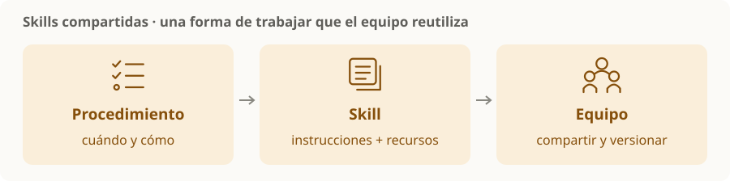

# Skills compartidas

> **En una frase:** empaquetar una forma de trabajar para que el equipo pueda reutilizarla y mejorarla con versiones.

## Qué contiene una skill
Una carpeta con `SKILL.md`: cuándo usarla, pasos y resultado esperado. Puede incluir referencias, plantillas o scripts. El formato es reutilizable, pero los mecanismos de carga dependen del agente.

| Alcance | Cuándo sirve |
|---|---|
| Personal | Preferencias o tareas que usás en varios proyectos |
| Repositorio | Procedimientos que debe compartir el equipo |
| Paquete compartido | Mantener una base común entre varios repositorios |

Codex descubre skills de repositorio en `.agents/skills/`; Claude Code usa `.claude/skills/`. Compartir el contenido no garantiza que ambos lean la misma carpeta ni interpreten todas las opciones igual. [Codex](https://learn.chatgpt.com/docs/build-skills) · [Claude Code](https://code.claude.com/docs/en/skills).

## Cómo mantenerlas útiles
- Una responsabilidad clara: revisar migraciones, crear una pantalla o preparar una PR.
- Un dueño y una versión conocida; evitar copias que evolucionan por separado.
- Probarlas con tareas representativas cuando cambien los pasos o scripts.

**Ejemplo:** una skill de migraciones reúne las convenciones del equipo, verificaciones y formato de entrega.

> [!TIP] Para recordar
> Una skill explica un procedimiento. Un hook lo dispara ante un evento. Ni el nombre de una skill ni un script incluido garantizan que sea adecuado para tu proyecto.

[[Instrucciones del repositorio]] · [[Hooks de desarrollo]] · [[Revisión de PR con agentes]]
