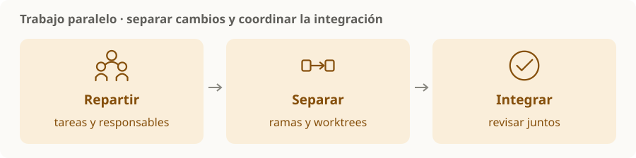

# Worktrees y trabajo paralelo

> **En una frase:** separar espacios de trabajo y responsabilidades para que varios cambios puedan avanzar sin pisarse.

## Tres decisiones
| Pieza | Para recordar |
|---|---|
| Rama | Identifica una línea de cambios |
| Worktree | Otro directorio de trabajo del mismo repositorio, con su checkout e índice propios |
| Reparto | Define quién toca qué y quién integra |

Los worktrees comparten el repositorio Git. Separan archivos de trabajo, pero no aíslan automáticamente bases de datos, puertos, servicios ni secretos. [Git worktree](https://git-scm.com/docs/git-worktree).

## Cuándo ayuda
- Tareas independientes o cambios en módulos distintos.
- Revisar un cambio mientras otra tarea sigue trabajando.
- Probar alternativas sin mezclar sus archivos.

**Ejemplo:** un agente implementa una pantalla y otro una prueba de integración en espacios separados; una persona o tarea responsable revisa cómo se juntan.

> [!TIP] Para recordar
> Más agentes no siempre ahorran tiempo. Si comparten contratos o archivos, acordá primero las interfaces y el orden de integración.

Un worktree reduce interferencias; la revisión y los tests al integrar detectan incompatibilidades entre cambios.

[[Flujo de trabajo y validación]] · [[Revisión de PR con agentes]]
