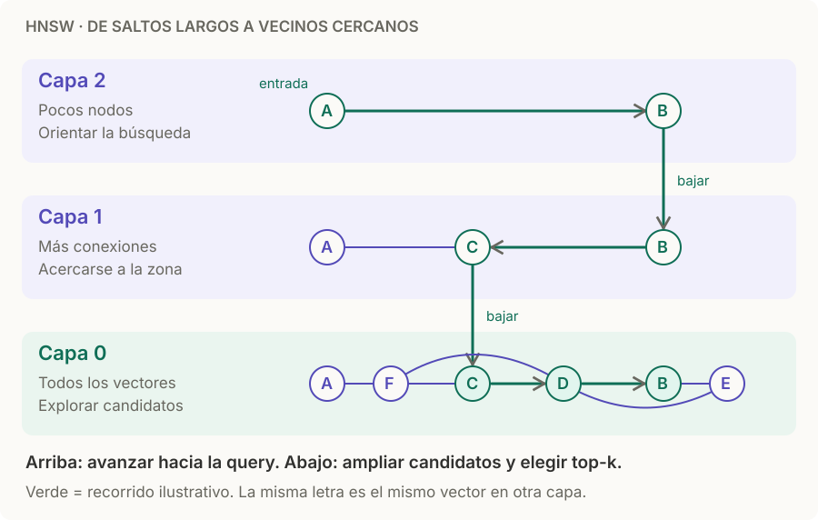

# ANN · HNSW

> **En una frase:** HNSW busca vecinos recorriendo un grafo en capas: primero se orienta con saltos largos y después explora candidatos cercanos.

## Cómo leerlo
1. **Arriba:** entrás por un nodo y avanzás hacia vecinos más cercanos a la query.
2. **Bajás:** cuando dejás de mejorar, seguís desde el mismo nodo en la capa inferior.
3. **En la base:** explorás varios candidatos y devolvés top-k. No es solo seguir una cadena greedy hasta el final.

La búsqueda es aproximada: el recorrido puede omitir vecinos reales. Las capas superiores contienen subconjuntos de los nodos inferiores. [Artículo de HNSW](https://arxiv.org/abs/1603.09320).

## Los 3 parámetros que importan
| Parámetro | Controla | Al subirlo |
|---|---|---|
| `M` | Conexiones del grafo | Más memoria; puede mejorar recall |
| `efConstruction` | Exploración al construir | Más trabajo de ingesta; puede mejorar el índice |
| `efSearch` | Exploración al consultar | Más recall a cambio de latencia |

En hnswlib, el ajuste de búsqueda se llama `ef`. Es distinto de **k**, que es cuántos resultados pedís. [Parámetros de hnswlib](https://github.com/nmslib/hnswlib).

## Cuándo sí / cuándo no
| Buen candidato | Compará otra opción cuando |
|---|---|
| Querés baja latencia con buen recall | Necesitás garantía de búsqueda exacta |
| Tenés memoria para vectores y conexiones | El costo de memoria domina: evaluá [[ANN IVF]], compresión o índices en disco |
| La búsqueda exacta ya es un cuello de botella | Un índice Flat resuelve tu carga con suficiente rapidez |

## Trade-offs
- Ajustá con recall@k frente a búsqueda exacta y latencia p95. El número de vectores por sí solo no decide el índice.
- Probá [[ACLs]] con tus filtros reales: el comportamiento depende de la implementación y de cuántos candidatos quedan permitidos.
- Para comparar con IVF, mantené fijos vectores, métrica, k y consultas; variá `efSearch` frente a `nprobe`.

## Se conecta con
[[Vector DB]] · [[ANN IVF]] · [[RAG básico]] · [[Golden dataset]]
