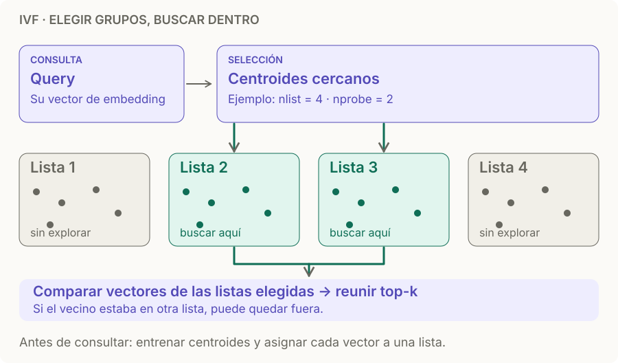

# ANN · IVF

> **En una frase:** IVF agrupa vectores en listas y, ante una query, busca dentro de algunos grupos cercanos en vez de recorrer toda la base.

## Cómo funciona
1. **Preparar:** entrenás centroides con una muestra representativa y asignás cada vector a una lista.
2. **Elegir:** buscás los centroides más cercanos a la query.
3. **Comparar:** explorás sus listas y reunís los mejores k candidatos.

IVF significa *Inverted File*. Si el vecino real está en una lista que no visitaste, puede quedar fuera. [Índices de Faiss](https://github.com/facebookresearch/faiss/wiki/Faiss-indexes).

## Dos perillas
| Parámetro | Recordatorio | Efecto |
|---|---|---|
| `nlist` | Cuántos grupos construís | Más particiones, más centroides que entrenar y seleccionar |
| `nprobe` | Cuántos grupos visitás | Más cobertura, más comparaciones |

Ejemplo ilustrativo: `nlist=100`, `nprobe=5` visita 5 listas; no implica exactamente 5% de los vectores porque las listas pueden tener tamaños diferentes. Ajustá `nprobe` midiendo recall y latencia. [Búsqueda IVF en Faiss](https://github.com/facebookresearch/faiss/wiki/Faster-search).

## IVF-Flat vs IVF-PQ
- **IVF-Flat:** guarda vectores sin compresión; calcula distancias sobre los vectores de las listas elegidas.
- **IVF-PQ:** comprime los vectores con Product Quantization; reduce memoria y añade error de cuantización.

IVF solo no significa “vectores comprimidos”. [Variantes de Faiss](https://github.com/facebookresearch/faiss/wiki/Faiss-indexes).

## Cuándo sí / cuándo no
Buen candidato si podés entrenar particiones representativas y ajustar el costo de búsqueda por listas. Compará con [[ANN HNSW]] usando el mismo [[Golden dataset]]; revisá las particiones si cambia mucho la distribución del contenido.

> **Para recordar:** HNSW recorre conexiones; IVF selecciona grupos. Ninguno garantiza el vecino exacto con su búsqueda aproximada habitual.

[[Vector DB]] · [[ANN HNSW]] · [[RAG básico]]
