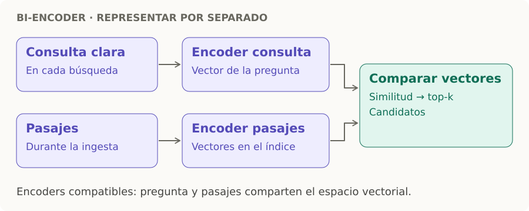

# Bi-encoder

> **En una frase:** convierte consulta y pasajes por separado en vectores que se pueden comparar.

- **Ingesta:** los pasajes se codifican una vez y sus vectores se guardan en [[Vector DB]].
- **Consulta:** después de [[Query rewrite]], codificás la pregunta y buscás vectores cercanos con encoders compatibles.
- **Salida:** candidatos por similitud; se pueden fusionar con BM25 en [[Búsqueda híbrida y reranking]].

Permite buscar rápido en muchos pasajes. El [[Cross-encoder]] puede afinar el orden después. [Referencia: bi-encoder y cross-encoder](https://www.sbert.net/examples/cross_encoder/applications/README.html).
