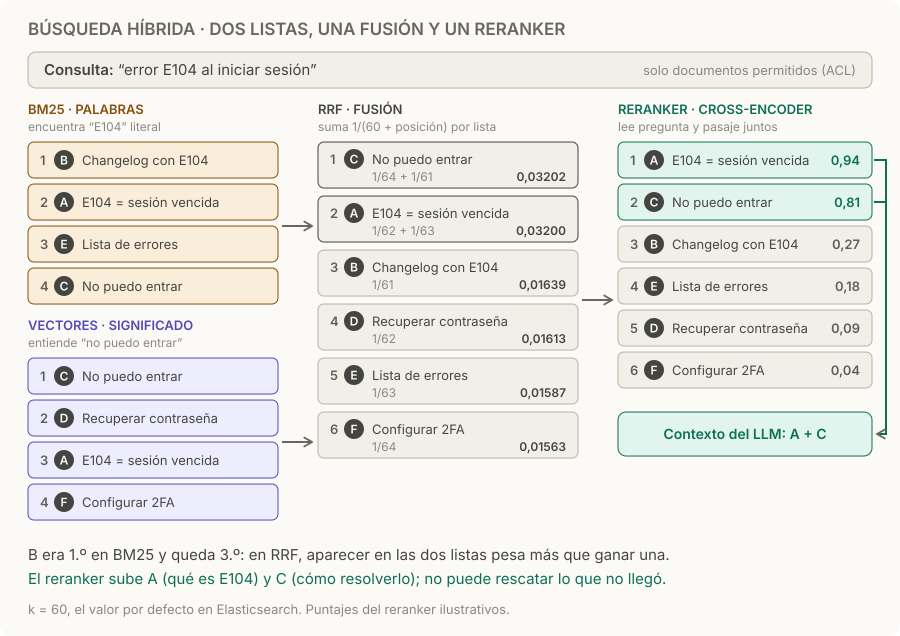

# Búsqueda híbrida y reranking

> **En una frase:** buscá por palabras y por significado, fusioná las dos listas por posición y dejá que un reranker elija qué pasajes llegan al modelo.

## Cómo funciona
1. **Dos búsquedas con los mismos filtros.** BM25 puntúa términos y la búsqueda vectorial compara significado. Ambas aplican [[ACLs]] y filtros de metadata.
2. **Fusión por posición (RRF).** Los scores de BM25 y de similitud no están en la misma escala, así que no se suman. RRF suma `1 / (k + posición)` por cada lista donde aparece el documento; con k = 60, el valor por defecto en Elasticsearch. Si un documento no aparece en una lista, esa lista no le suma nada. [RRF](https://www.elastic.co/docs/reference/elasticsearch/rest-apis/reciprocal-rank-fusion).
3. **Reranking.** Un cross-encoder lee pregunta y pasaje juntos y puntúa su relevancia. Es más preciso que comparar embeddings por separado, pero más lento: por eso se aplica solo a los primeros candidatos, por ejemplo 50 → 5.
4. **Recorte.** Solo los mejores pasan al contexto: [[Presupuesto de contexto]].

| Pieza | Encuentra | Se le escapa |
|---|---|---|
| **BM25** | Términos exactos: códigos, SKUs, nombres propios | Sinónimos y paráfrasis: “no puedo entrar” |
| **Vectores** | El mismo significado con otras palabras | Identificadores: dos códigos parecidos quedan cerca aunque sean cosas distintas |
| **Reranker** | Qué pasaje responde de verdad a la pregunta | Todo lo que no llegó entre los candidatos |

## Ejemplo
Consulta: “error E104 al iniciar sesión”. Son los mismos números del diagrama.
- **BM25** pone primero a B, un changelog que menciona E104 pero no lo explica. **Los vectores** ponen primero a C, “No puedo entrar”.
- **RRF:** A y C aparecen en las dos listas y suben (0,03200 y 0,03202). B, que solo está en BM25, queda tercero (0,01639).
- **Reranker:** A explica qué es E104 (0,94) y C cómo resolverlo (0,81). Esos dos llegan al contexto.

## Cómo decidir
- Compará vectorial → híbrida → híbrida con reranking, usando las mismas preguntas del [[Golden dataset]].
- Medí recall@k de los candidatos **antes** del reranker y nDCG del orden final ([[RAG evals]]), además de calidad de respuesta, costo y latencia p95.
- Ajustá por separado dos números: cuántos candidatos recuperás (define el recall) y cuántos pasás al contexto (define ruido y presupuesto).
- Conservá cada etapa solo si tus evals muestran una mejora útil. [Ranking y reranking](https://www.elastic.co/docs/solutions/search/ranking).

## Cuándo sí / cuándo no
| Usalo cuando | Evitalo cuando |
|---|---|
| Las preguntas mezclan códigos o nombres con lenguaje natural | Todas las consultas son por ID exacto: usá un filtro por campo |
| La evidencia está entre los candidatos, pero no arriba | La evidencia ni siquiera aparece: revisá [[Chunking]], [[Modelos de embedding]] o la consulta |
| Tu presupuesto de latencia admite una etapa más | No admite el reranker: probá solo la búsqueda híbrida |

## Trampas
- **Sumar scores crudos.** BM25 no tiene tope y la similitud coseno sí; sumarlos deja que una escala domine. Si combinás puntajes en vez de posiciones, normalizalos y calibrá los pesos con evals.
- **Esperar que el reranker rescate lo que no llegó.** Si el pasaje no está entre los candidatos, ningún reranker lo encuentra. Mirá el recall antes de culpar al orden.
- **Usar BM25 como filtro.** BM25 puntúa, no filtra: para “el pedido 123” exacto, usá un filtro por campo.
- **Filtrar permisos al final.** El reranker, que a veces es un servicio externo, ya habría visto contenido no autorizado, y podés quedarte con menos de k resultados. Aplicá ACL en las dos búsquedas.
- **Analizador sin español.** Sin stemming en español, “errores” no coincide con “error” en BM25. Configurá el analizador del idioma de tus documentos.

> [!TIP] Para recordar
> **Palabras y significado para encontrar, posiciones para fusionar, un reranker para ordenar.**

## Practicá
> [!question]- El pasaje correcto aparece entre los 50 candidatos, pero no entre los 5 finales. ¿Qué revisás?
> El problema está después de recuperar: en la fusión o en el reranker. Revisá si el reranker ve el pasaje completo o truncado por su límite de tokens; si entiende el idioma y el dominio (un reranker entrenado en inglés con consultas en español); si el chunk trae título o sección para juzgarlo; y si hay casi duplicados ocupando el top-5. Medí nDCG@5 con y sin reranker.

> [!question]- Un documento es 1.º en BM25 y no aparece en la lista vectorial; otro es 5.º en las dos. Con k = 60, ¿cuál queda arriba?
> El primero suma 1/61 = 0,01639. El segundo, 1/65 + 1/65 = 0,03077. Gana el segundo: RRF premia aparecer en varias listas más que ganar una.

> [!question]- Los usuarios buscan “SKU-48213” y la búsqueda vectorial devuelve productos parecidos, pero no ese. ¿Qué cambiás?
> Los embeddings representan significado, y dos códigos parecidos quedan cerca aunque sean productos distintos. Agregá BM25 o, mejor, detectá el patrón de SKU y aplicá un filtro exacto antes de buscar por significado.

## Se conecta con
[[RAG básico]] · [[Modelos de embedding]] · [[Vector DB]] · [[ACLs]] · [[RAG evals]] · [[Presupuesto de contexto]] · [[Caso práctico - Asistente de soporte]]
