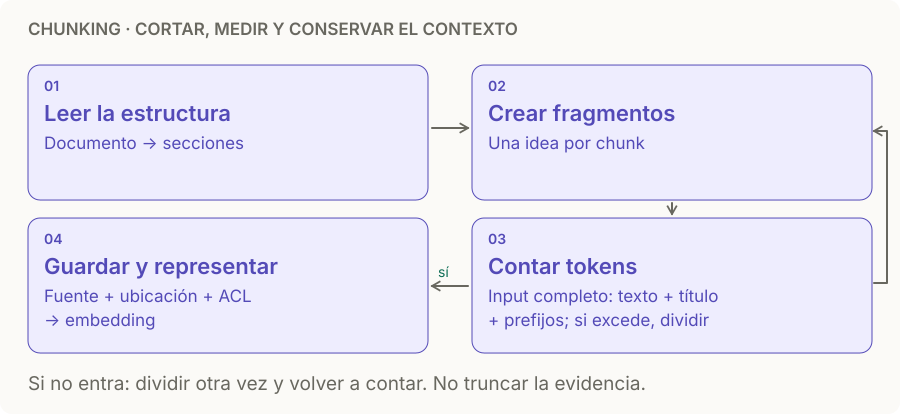

# Chunking

> **En una frase:** cortá por ideas que puedan responder una pregunta; usá los tokens como límite, no como tijera ciega.

## Diagrama

## Qué tamaño probar
**Puntos de partida para experimentar**, no valores óptimos garantizados. Contá con el tokenizer del modelo; reservá espacio para título, prefijos y tokens especiales.

| Contenido | Unidad que conviene conservar | Tamaño inicial a probar |
|---|---|---|
| FAQ | Pregunta + respuesta juntas | Una pareja; dividí solo si excede el límite |
| Manual / wiki | Sección con su título | 300–600 tokens |
| Texto narrativo | Párrafos que desarrollan una idea | 500–1.000 tokens si el modelo lo admite |
| Código | Función / clase + firma y contexto | Por estructura; subdividí bloques grandes |
| Tabla | Encabezados + filas relacionadas + unidades | Por filas; repetí los encabezados |
| Audio / video | Tema o escena con inicio y fin | Ver [[RAG multimedia]] |

Como referencia externa, Azure propone empezar con **512 tokens y 128 de overlap** para texto. Ajustalo según tus datos y el límite del modelo: un encoder de 512 tokens necesita margen para el resto del input. [Guía de chunking de Azure](https://learn.microsoft.com/en-us/azure/search/vector-search-how-to-chunk-documents).

## Overlap: compartir un borde
Es texto repetido entre chunks consecutivos para no perder la idea que cruza un corte.

- Probá **0%, 10% y 20%** manteniendo fijo el tamaño del chunk. Una FAQ independiente puede no necesitar overlap.
- Si cortás por estructura y cada sección se entiende sola, duplicar contenido puede agregar ruido.
- No cruces documentos ni límites de permisos. Cada chunk conserva sus [[ACLs]].
- Más overlap → más vectores y más resultados casi iguales. Deduplicá los candidatos antes de llenar el prompt.

Ejemplo ilustrativo: tamaño 500, overlap 100 → ventanas `[0,500)`, `[400,900)`, `[800,1300)`. El avance es 400 tokens. En texto largo, eso implica aproximadamente **25% más chunks** que sin overlap (`500 / 400 = 1,25`).

## Cuándo sí / cuándo no
| Estrategia | Usala cuando | Evitala cuando |
|---|---|---|
| Tamaño fijo | Querés un baseline rápido | Rompe tablas, código o condiciones importantes |
| Recursiva / por estructura | Hay títulos, párrafos, listas o funciones | El parser perdió la estructura; arreglalo primero |
| Semántica | Los cambios de tema no tienen marcas claras | El costo extra no mejora retrieval en tus evals |
| Parent-child | Un fragmento encuentra la respuesta, pero falta contexto | Expandir trae demasiado texto o mezcla permisos |

**Parent-child:** indexás hijos pequeños; al recuperar uno, traés la sección padre o sus vecinos, respetando permisos y presupuesto. Ejemplo: encontrás “20 días” y expandís a la sección que explica a quién aplica. El chunk de búsqueda y el contexto del LLM pueden tener tamaños distintos.

## Cómo elegir con evidencia
1. Armá un [[Golden dataset]] con pregunta, respuesta y **pasaje fuente estable** (documento + ubicación), para poder comparar distintos cortes.
2. Con el modelo fijo, compará tamaños compatibles con su límite; por ejemplo 256, 512 y 1.024 si admite todos. Después variá el overlap.
3. Medí si aparece la evidencia necesaria entre los candidatos (recall de evidencia@k), cuánto ruido llega al prompt y si la respuesta cita bien.
4. Registrá también tokens de contexto, latencia y costo de indexación. Al aumentar el chunk, `k × tamaño` puede crecer mucho.
5. Elegí con el conjunto de desarrollo y confirmá una vez con holdout. Guardá `chunker_version` y sus parámetros.

## Trade-offs
- Chunks chicos facilitan coincidencias puntuales, pero pueden separar una regla de su excepción.
- Chunks grandes conservan contexto, pero pueden mezclar temas y gastar el presupuesto del prompt.
- Más dimensiones no reparan una tabla mal cortada. Primero revisá parsing, límites y evidencia recuperada.

## Se conecta con
[[Normalization]] · [[Modelos de embedding]] · [[Vector DB]] · [[RAG básico]] · [[RAG multimedia]]
