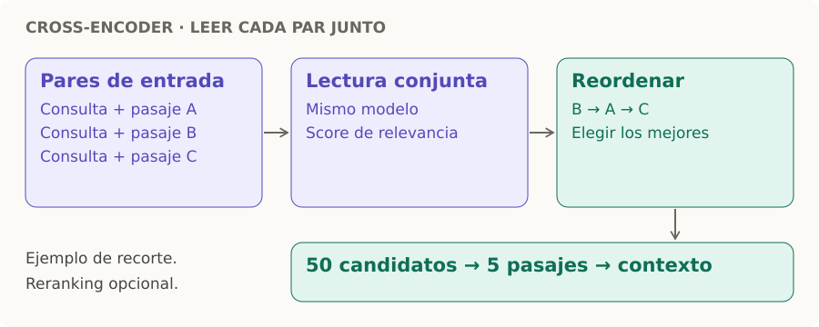

# Cross-encoder

> **En una frase:** lee la consulta y cada pasaje juntos para puntuar qué tan relevante es ese par.

- **Entrada:** consulta clara + candidatos del [[Bi-encoder]] o de la [[Búsqueda híbrida y reranking|búsqueda híbrida]].
- **Salida:** un score por par; reordenás y elegís, por ejemplo, 5 de 50 pasajes para el contexto del LLM.
- **Costo:** suele mejorar el orden, pero evalúa cada par. Por eso se aplica a pocos candidatos; no recupera pasajes ausentes.

Es un reranker opcional. Su salida es un score de relevancia, no un embedding para indexar. [Referencia: retrieve & rerank](https://www.sbert.net/examples/sentence_transformer/applications/retrieve_rerank/README.html).
