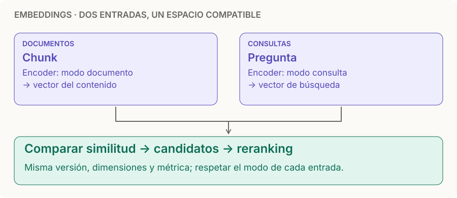

# Modelos de embedding

> **En una frase:** el embedding convierte contenido en coordenadas para buscar por significado; el modelo define ese espacio y las dimensiones definen el largo del vector.

## Diagrama

## Tres tamaños distintos
| Medida | Qué significa | Ejemplo |
|---|---|---|
| Tokens del chunk | Cuánto contenido entra | Un fragmento de 400 tokens |
| Límite de entrada | Máximo que admite el encoder | BGE-M3 admite hasta 8.192 tokens |
| Dimensiones | Cuántos números salen por vector denso | BGE-M3 devuelve 1.024 números |

Con un encoder denso de longitud fija, un texto corto y uno largo producen vectores del mismo largo. **512 tokens no implican 512 dimensiones.** El límite de entrada tampoco es una recomendación de tamaño de chunk. Especificaciones de BGE-M3: [ficha del modelo](https://huggingface.co/BAAI/bge-m3).

## Modelos para recordar
Ejemplos representativos, sin ranking. Especificaciones consultadas el **13-09-2026**; verificá el endpoint antes de implementarlo.

| Modelo                           | Modalidad / ejecución                        | Dimensiones                         | Criterio práctico                                                                                                                               |
| -------------------------------- | -------------------------------------------- | ----------------------------------- | ----------------------------------------------------------------------------------------------------------------------------------------------- |
| `BAAI/bge-m3`                    | Texto multilingüe; pesos para ejecutar local | 1.024 en modo denso                 | Candidato para español e infraestructura propia; también ofrece recuperación sparse y multivector. [Ficha](https://huggingface.co/BAAI/bge-m3)  |
| `intfloat/multilingual-e5-large` | Texto multilingüe; pesos para ejecutar local | 1.024                               | Límite de 512 tokens; exige prefijos `query: ` y `passage: ` incluso en español. [Ficha](https://huggingface.co/intfloat/multilingual-e5-large) |
| `embed-v4.0` de Cohere           | API; texto, imágenes y entradas mixtas       | 256 / 512 / 1.024 / 1.536 (default) | Candidato para documentos con contenido visual; admite hasta 128k tokens de contexto. [Modelos](https://docs.cohere.com/docs/cohere-embed)      |
| `voyage-multimodal-3.5`          | API; texto, imágenes y video                 | 256 / 512 / 1.024 (default) / 2.048 | Candidato cuando necesitás recuperar escenas; contexto de 32.000 tokens. [Documentación](https://docs.voyageai.com/docs/multimodal-embeddings)  |

## Cómo elegir modelo y dimensiones
1. **Filtrá por necesidad:** idioma real de las preguntas, dominio, modalidad, licencia y ejecución local o API.
2. **Compará modelos con los mismos documentos y preguntas.** Incluí español, siglas, nombres y preguntas que requieren dos pasajes. Ajustá el chunk al límite de cada candidato y documentá esa diferencia.
3. **Después compará dimensiones dentro del mismo modelo**, si las permite. Como experimento, probá 512 y 1.024 frente al default; medí recall/nDCG, latencia y memoria.
4. **Quedate con la configuración más pequeña que cumpla tu objetivo de calidad.** Más dimensiones pueden ayudar, pero no garantizan mejores respuestas.

> [!TIP] Regla para recordar
> **Modelo = idioma del espacio; dimensiones = largo de las coordenadas.** Dos modelos de 1.024 dimensiones no hablan necesariamente el mismo idioma vectorial.

## Cuánto ocupa
Para **un vector denso float32 por chunk**: `bytes = cantidad_de_chunks × dimensiones × 4`.

| Un millón de chunks | Solo vectores, GB decimales |
|---|---|
| 512 dimensiones | 2,048 GB |
| 1.024 dimensiones | 4,096 GB |
| 1.536 dimensiones | 6,144 GB |

Sumá índice [[ANN HNSW]], metadata, texto, réplicas y overhead. Cuantizar cambia los bytes por número; reducir dimensiones cambia cuántos números guardás. Son decisiones distintas y ambas requieren evaluar pérdida de calidad.

## Compatibilidad: no mezclar coordenadas
- Consulta y documentos deben usar **encoders compatibles, versión y dimensión iguales**, además de los modos de entrada que indique el proveedor.
- En Cohere usá `search_document` para documentos y `search_query` para consultas; la dimensión se configura con `output_dimension`. [API Embed](https://docs.cohere.com/reference/embed).
- BGE-M3 no necesita agregar instrucciones a las consultas; E5 sí usa sus prefijos. No copies el preprocesamiento de un modelo a otro. [BGE-M3](https://huggingface.co/BAAI/bge-m3) · [E5](https://huggingface.co/intfloat/multilingual-e5-large).
- Acortá vectores solo mediante el mecanismo soportado por el modelo (por ejemplo, Matryoshka). Cortar números de cualquier embedding no es una reducción válida por defecto.
- Configurá la métrica y la normalización según el modelo y la DB. Los scores de modelos o índices distintos no se comparan directamente.
- Al cambiar modelo, versión o dimensión, generá un índice nuevo y sus embeddings, validalo y cambiá la lectura. Versioná también [[Caché de ingesta y búsqueda]].

## Cuándo sí / cuándo no
| Usalo cuando | Complementalo o evitá depender solo de él cuando |
|---|---|
| La consulta y el documento dicen lo mismo con palabras distintas | Buscás SKUs, IDs o nombres exactos: combiná búsqueda léxica |
| Necesitás candidatos por significado | Necesitás filtrar permisos: aplicá [[ACLs]] explícitas |
| Un modelo multimodal alinea texto e imágenes | Solo tenés un modelo de texto: una URL de imagen no representa sus píxeles |

## Se conecta con
[[Chunking]] · [[Vector DB]] · [[ANN HNSW]] · [[RAG multimedia]] · [[Golden dataset]]
