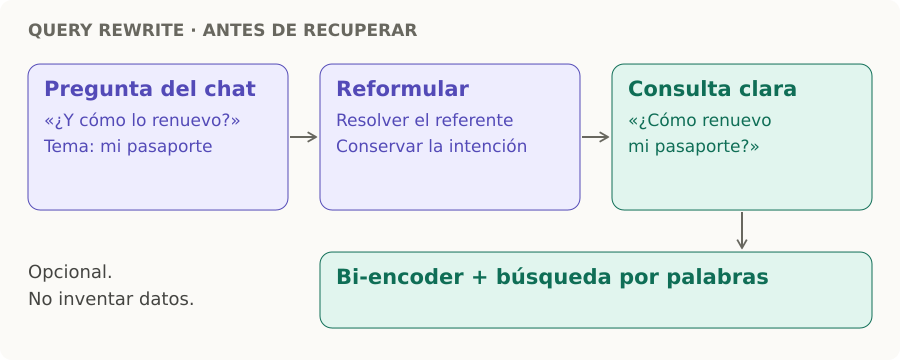

# Query rewrite

> **En una frase:** reformulá la pregunta para que el buscador entienda qué necesitás, conservando su intención.

- **Entrada:** pregunta + contexto relevante del chat. “¿Y cómo lo renuevo?” → “¿Cómo renuevo mi pasaporte?” si ese era el tema.
- **Lugar:** antes del embedding y de BM25; la consulta clara pasa a [[Bi-encoder]] y [[Búsqueda híbrida y reranking|búsqueda híbrida]].
- **Cuidado:** conservá códigos, fechas y restricciones. Si falta contexto, pedí aclaración; no inventes el referente.

Es opcional y agrega latencia. Compará el retrieval con la pregunta original y la reformulada. [Referencia: query rewriting](https://learn.microsoft.com/en-us/azure/search/semantic-how-to-query-rewrite).
