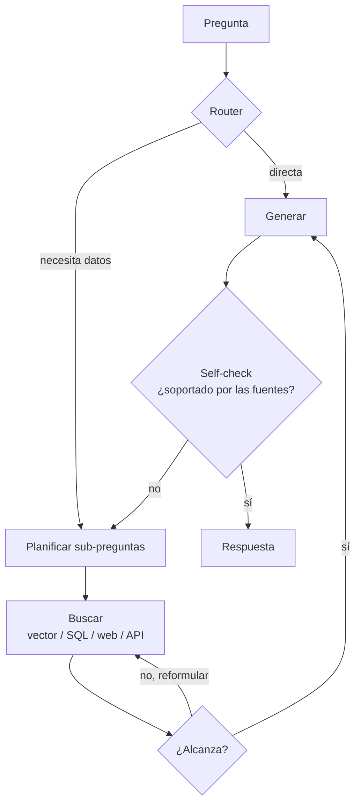

# RAG agéntico

> **En una frase:** en vez de una sola búsqueda fija, un agente decide si buscar, dónde, cuántas veces y si lo que encontró alcanza antes de responder.

## Diagrama

## RAG vs RAG agéntico
| | [[RAG básico]] | RAG agéntico |
|---|---|---|
| Búsquedas | Pipeline predefinido | El agente decide los pasos según resultados |
| Fuentes | Una o varias, configuradas en el pipeline | Una o varias, elegidas durante la ejecución |
| Preguntas compuestas | Puede resolverlas si el pipeline reúne la evidencia | Puede adaptar búsquedas dependientes; no garantiza acertar |
| Latencia y costo | Dependen del pipeline | Dependen de llamadas, modelos y límites; medilos |
| Fallas | Recuperación incompleta o mala interpretación | Añade riesgo de loops y sobre-búsqueda |

RAG no exige una Vector DB. La diferencia principal es quién controla la búsqueda: código o decisiones del modelo. Agregá autonomía si mejora tus evals. [Workflows y agentes](https://www.anthropic.com/engineering/building-effective-agents).

## Estrategias
- **Routing**: elegir índice o herramienta según la pregunta.
- **Multi-hop**: la respuesta a la sub-pregunta 1 es input de la búsqueda 2.
- **Corrección de recuperación**: si falta evidencia, reformular o consultar otra fuente autorizada.
- **Verificación de respaldo**: revisar afirmaciones contra las fuentes; una autocrítica del modelo también puede fallar.

> [!WARNING] Ponele límites
> Máximo de iteraciones, timeout y presupuesto de tokens. Sin eso, el agente "buscando mejor" se come el costo del mes.

## Se conecta con
Es el puente hacia [[Orquestador workers]] cuando las sub-tareas son distintas entre sí. Su router es la misma idea que [[Router handoff]], aplicada a fuentes en vez de agentes.
