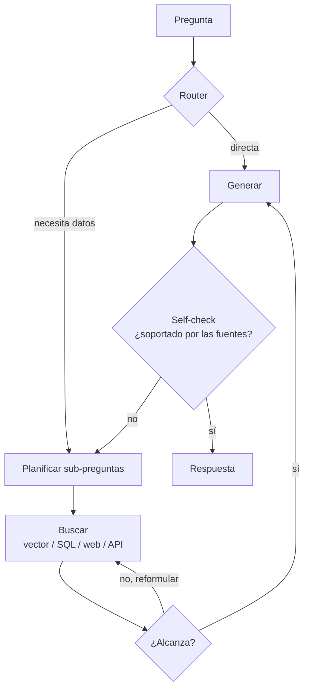

# RAG agéntico

> **En una frase:** en vez de una sola búsqueda fija, un agente decide si buscar, dónde, cuántas veces y si lo que encontró alcanza antes de responder.

## Diagrama

## RAG vs RAG agéntico
| | [[RAG básico]] | RAG agéntico |
|---|---|---|
| Búsquedas | 1, fija | N, decididas en runtime |
| Fuentes | Una Vector DB | Varias herramientas |
| Preguntas compuestas | Mal | Bien (multi-hop) |
| Latencia y costo | 1x | 3x a 10x |
| Fallas | Predecibles | Loops, sobre-búsqueda |

## Patrones con nombre
- **Routing**: elegir índice o herramienta según la pregunta.
- **Multi-hop**: la respuesta a la sub-pregunta 1 es input de la búsqueda 2.
- **Corrective RAG**: si los chunks son malos, buscar en otro lado (web).
- **Self-RAG**: el modelo critica su propia respuesta contra las fuentes.

> [!WARNING] Ponele límites
> Máximo de iteraciones, timeout y presupuesto de tokens. Sin eso, el agente "buscando mejor" se come el costo del mes.

## Se conecta con
Es el puente hacia [[Orquestador workers]] cuando las sub-tareas son distintas entre sí. Su router es la misma idea que [[Router handoff]], aplicada a fuentes en vez de agentes.
