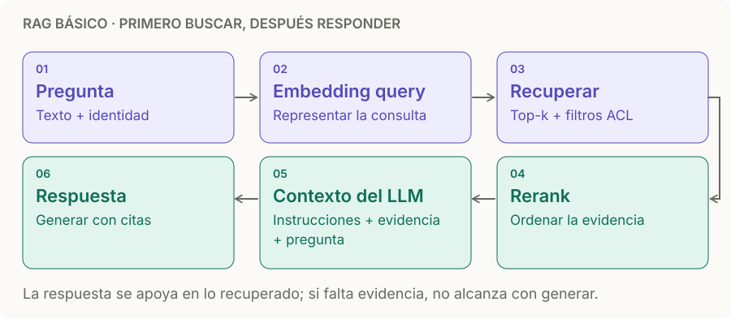

# RAG básico

> **En una frase:** antes de responder, buscás en tus datos, pegás lo encontrado en el prompt y el LLM responde con eso a la vista. Retrieval-Augmented Generation.

## Diagrama

## Palancas de calidad del retrieval
| Palanca | Qué hace | Cuándo |
|---|---|---|
| [[Chunking]] | Tamaño y límites de los pedazos | Siempre. Respetá secciones, no cortes en medio de una tabla |
| [[Modelos de embedding]] | Modelo, dimensión e idioma del espacio de búsqueda | Comparalos con tus preguntas reales |
| [[Búsqueda híbrida y reranking\|Búsqueda híbrida]] | BM25 (palabras) + vectores (significado) | Nombres propios, códigos, SKUs |
| [[Búsqueda híbrida y reranking\|Reranking]] | Reordena candidatos; por ejemplo top-50 → top-5 | Cuando el top-k tiene ruido |
| Query rewriting | Reformular la pregunta antes de buscar | Preguntas coloquiales o con contexto de chat |
| Filtros de metadata | Fecha, fuente, [[ACLs]] | Siempre que existan |

## Fallas típicas y quién las causa
- Alucina → puede faltar evidencia en el retrieval o el LLM ignorar / interpretar mal la que recibió. Revisá ambos pasos.
- Responde a medias → chunk cortado en el lugar equivocado.
- Responde con lo viejo → falta [[Incremental sync]] o dedup de versiones.

## Se conecta con
Se apoya en [[Vector DB]] y [[ANN HNSW]]. Se mide con [[RAG evals]] usando el [[Golden dataset]] (recuperación y calidad de respuesta). Cuando una búsqueda no alcanza → [[RAG agéntico]].

Si la evidencia está en una imagen, una grabación o un video → [[RAG multimedia]].
