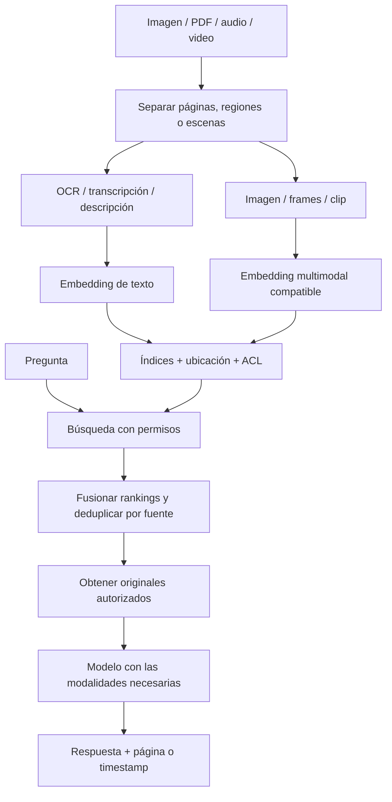

# RAG multimedia · implementación

> **En una frase:** recuperás la imagen, página o escena que contiene la evidencia, y le pasás al modelo el contenido que necesita ver u oír para responder con una cita verificable.

[[RAG multimedia|Volver al resumen visual]].

## Diagrama


Son rutas que podés combinar; no hace falta implementar ambas desde el inicio. Si usás encoders diferentes, mantené espacios separados y fusioná **rankings**, no distancias crudas.

## Tres formas de hacerlo
| Ruta | Qué indexás | Cuándo sí | Qué podés perder |
|---|---|---|---|
| Convertir a texto | OCR, transcripción o descripción → embedding textual | Preguntas sobre palabras impresas o lo que se dijo | Layout, gestos, colores, sonidos y detalles que la descripción omite |
| Embedding multimodal | Píxeles y texto en un espacio compatible | Buscar una figura o una pantalla por su apariencia | Detalles pequeños; depende de resolución y modelo |
| Combinar rutas | Índices textual y visual, vinculados al original | La respuesta puede estar en la narración o en la pantalla | Más almacenamiento, procesamiento y evaluación |

Los modelos multimodales de Cohere permiten recuperar imágenes desde texto. Voyage multimodal 3.5 también admite secuencias de frames de video. **No presupongas que “multimodal” incluye audio**: verificá las modalidades del modelo. [Cohere](https://docs.cohere.com/docs/multimodal-embeddings) · [Voyage](https://docs.voyageai.com/docs/multimodal-embeddings).

## Cómo chunkear cada medio
| Medio | Unidad recuperable | Qué conservar |
|---|---|---|
| Imagen / gráfico | Imagen completa o región significativa | Archivo, recorte, título, leyenda, ejes y unidades |
| PDF / diapositivas | Página o bloque que mantiene el layout | Documento, página, coordenadas y texto extraído |
| Audio hablado | Turno o segmento sobre un tema | Archivo, hablante, transcripción, inicio y fin |
| Video | Escena con frames ordenados + transcripción alineada | Archivo, timestamps, frames y relación con audio |

Para videos largos, segmentá por escena o cambio de tema y alineá los cortes con la transcripción. Ajustá resolución y frecuencia de frames al presupuesto del encoder. [Guía de video de Voyage](https://blog.voyageai.com/2026/01/15/voyage-multimodal-3-5/).

**Experimento inicial para una clase o tutorial:** compará segmentos de 15, 30 y 60 segundos, ajustados a cortes naturales. Si buscás un clic o un gesto breve, probá ventanas menores y más frames; si buscás una explicación, quizá necesites expandir a segmentos vecinos. Estos intervalos son hipótesis de prueba, no límites de una API.

## Ejemplo: “¿Dónde activa los permisos?”
1. Un tutorial muestra el panel ACL entre **02:14 y 02:28**; el narrador dice “lo activamos acá”.
2. La transcripción sola tiene poca información. Un frame muestra el interruptor y sus etiquetas.
3. El retrieval visual encuentra ese segmento; la búsqueda textual aporta contexto del tema.
4. Se recuperan los frames originales y el texto alineado, después de comprobar [[ACLs]].
5. Un modelo con visión responde usando la pantalla y cita **`tutorial.mp4 · 02:14–02:28`**. La app debe abrir el archivo en ese punto.

El embedding sirve para **encontrar**, no reemplaza el archivo ni permite reconstruirlo. Una descripción generada puede ayudar a buscar, pero no equivale a evidencia fiel del original.

## Metadata mínima: ejemplo de un segmento
```json
{
  "doc_id": "media:tutorial-acl",
  "chunk_id": "media:tutorial-acl:v2:134-148",
  "modality": "video",
  "source_uri": "media/tutorial-acl.mp4",
  "start_seconds": 134,
  "end_seconds": 148,
  "frame_times_seconds": [134, 140, 147],
  "transcript": "Lo activamos acá…",
  "acl": ["grupo:equipo"],
  "source_version": "v2",
  "chunker_version": "scene-v1"
}
```
Para PDF usá `page` y, si corresponde, `bbox`; para imágenes, ubicación del recorte. Guardá los originales en archivos u object storage y vinculalos desde la metadata. Registrá modelo, versión y dimensión en la configuración del índice.

## Fallas típicas
- **“El audio lo explica”** → el encoder de video puede estar viendo solo frames. Agregá transcripción o un modelo que procese audio.
- **El OCR leyó mal una cifra** → recuperá una imagen suficientemente nítida y verificá ejes, unidades y leyendas.
- **El evento no aparece** → el muestreo de frames lo saltó. Aumentá cobertura para ese tipo de consulta.
- **El LLM no ve la imagen** → mandar solo una URL como texto no garantiza que el proveedor descargue o procese sus píxeles; usá su entrada de imagen admitida.
- **La cita no abre la escena correcta** → faltan timestamps o cambió el archivo. Vinculá [[Document IDs]] y versión.
- **Un thumbnail revela datos privados** → permisos en chunks, originales, previews y cachés; al revocar acceso, invalidalos.

## Cómo medirlo
En [[Golden dataset]], agregá casos que solo se resuelven viendo la imagen, otros con audio y otros combinados. Medí recuperación de la **página, región o intervalo correcto**, fidelidad de la respuesta, exactitud de la cita y latencia. Incluí eventos breves y preguntas cuya respuesta no está en el material.

## Trade-offs
- Transcribir y hacer OCR facilita la búsqueda textual, pero puede borrar información visual o acústica.
- Más frames y resolución dan más cobertura a cambio de costo y latencia; medí si capturan evidencia adicional.
- Un modelo que recupera imágenes no tiene por qué ser el mismo que genera la respuesta.

## Se conecta con
[[Chunking]] · [[Modelos de embedding]] · [[Normalization]] · [[ACLs]] · [[RAG básico]]
