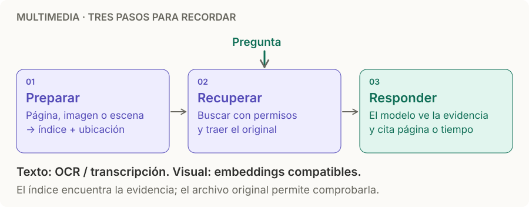

# RAG multimedia

> **En una frase:** encontrá la imagen, página o escena correcta; pasale la evidencia al modelo y respondé con una cita.

## Qué se recupera
| Material | Unidad para buscar y citar |
|---|---|
| Imagen / PDF | Imagen, región o página |
| Audio | Fragmento de transcripción con inicio y fin |
| Video | Escena: frames + transcripción alineada |

## Elegí la ruta
- **Lo importante son las palabras:** OCR o transcripción → búsqueda textual.
- **Lo importante es lo que se ve:** embedding multimodal → recuperar imagen o frames.
- **Importan ambos:** combiná resultados y volvé al original; con encoders distintos, fusioná rankings, no distancias.

**Ejemplo:** “¿Dónde activa los permisos?” → recuperás la pantalla del tutorial → respondés con la cita **02:14–02:28**.

> [!TIP] Tres recordatorios
> El embedding encuentra; el original demuestra. Conservá [[ACLs]] y ubicación. Un modelo de video no necesariamente procesa audio.

## Profundizar
[[RAG multimedia - Implementación|Ver implementación: chunking, modelos, metadata, fallas y evaluación]].

[[Chunking]] · [[Modelos de embedding]] · [[RAG básico]]
