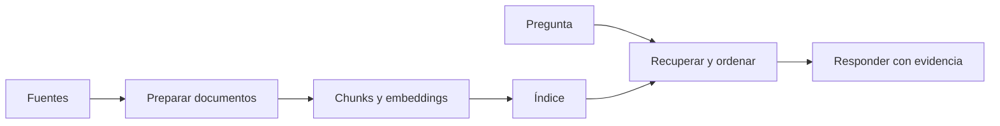

# RAG

> **En una frase:** preparar las fuentes, recuperar evidencia autorizada y usarla para responder.

## Dos recorridos


## Orden de lectura
1. **Panorama:** [[RAG básico]] muestra la consulta completa.
2. **Ingesta:** [[Connector]] → [[Normalization]] → [[Document IDs]] → [[Deduplication]] → [[Chunking]] → [[Modelos de embedding]]. [[Incremental sync]] mantiene los datos al día.
3. **Índice y recuperación:** [[Vector DB]], las alternativas [[ANN HNSW]] / [[ANN IVF]] y [[Búsqueda híbrida y reranking]]. HNSW e IVF no son etapas consecutivas.
4. **Variantes:** [[RAG agéntico]] adapta la búsqueda; [[RAG multimedia]] cambia qué evidencia se procesa. Su detalle está en [[RAG multimedia - Implementación]].

El diagrama muestra el caso con índice vectorial; RAG también puede recuperar con otros mecanismos. El orden de estudio no obliga a usar todas las técnicas.

## Conexiones con otras categorías
- **Seguridad:** [[ACLs]] acompaña documentos y búsquedas.
- **Runtime:** [[Caché de ingesta y búsqueda]] evita repetir trabajo válido.
- **Evals:** [[RAG evals]] y [[Caso práctico - Asistente de soporte]].

## Estado de los nodos
```dataview
TABLE WITHOUT ID file.link AS nodo, bloque, estado
FROM "rag" WHERE tipo != "mapa" SORT orden
```

[[RAG.canvas|Abrir el canvas de RAG]]

Para publicar el buscador a hosts compatibles: [[MCP]] → [[RAG como tool MCP]].
