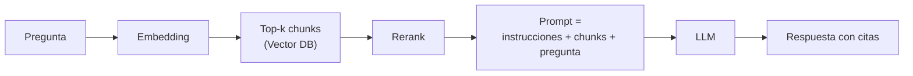

# RAG

> **En una frase:** antes de responder, buscás en tus datos, pegás lo encontrado en el prompt y el LLM responde con eso a la vista. Retrieval-Augmented Generation.

## Diagrama

## El 80% de la calidad está en el retrieval
| Palanca | Qué hace | Cuándo |
|---|---|---|
| Chunking | Tamaño y límites de los pedazos | Siempre. Respetá secciones, no cortes en medio de una tabla |
| Hybrid search | BM25 (palabras) + vectores (significado) | Nombres propios, códigos, SKUs |
| Rerank | Un cross-encoder reordena top-50 → top-5 | Cuando el top-k tiene ruido |
| Query rewriting | Reformular la pregunta antes de buscar | Preguntas coloquiales o con contexto de chat |
| Filtros de metadata | Fecha, fuente, [[ACLs]] | Siempre que existan |

## Fallas típicas y quién las causa
- Alucina → el retrieval no trajo la respuesta (no es culpa del LLM).
- Responde a medias → chunk cortado en el lugar equivocado.
- Responde con lo viejo → falta [[Incremental sync]] o dedup de versiones.

## Se conecta con
Se apoya en [[Vector DB]] y [[ANN HNSW]]. Se mide con [[Golden dataset]] (faithfulness, context precision/recall). Cuando una búsqueda no alcanza → [[RAG agéntico]].
